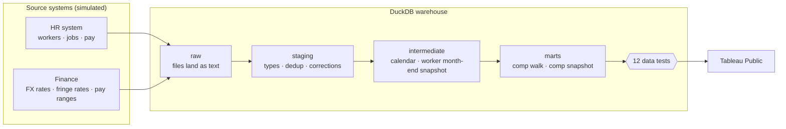
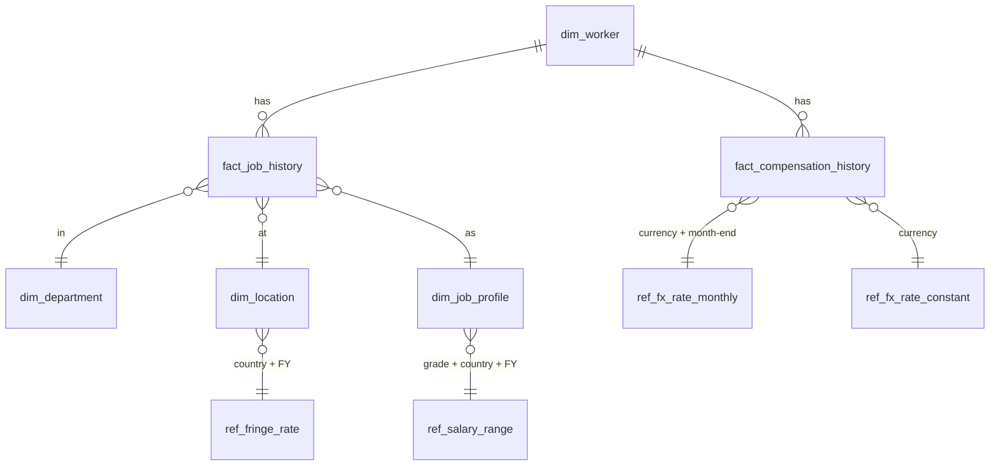

# People Analytics Warehouse

[](https://github.com/thialp/people-analytics-warehouse/actions/workflows/pipeline.yml)

An HR data warehouse for a fictional global company, built to answer the two questions every workforce review starts with, in SQL that reconciles exactly:

| Case study | Question | Dashboard |
|---|---|---|
| **1. [Workforce Cost Bridge](#1-business-problem)** | *Why did our workforce cost change?* A monthly walk of annualized pay run-rate that splits every dollar of change into hires, terminations, transfers, promotions, merit, mobility, FTE, fringe and currency, in **nominal** and **constant** currency, reconciled to the cent. | Tableau Public: *coming soon* |
| **2. [Headcount & FTE Walk](#case-study-2-headcount--fte-walk)** | *How did the workforce change, and why?* Opening + hires − leavers ± internal moves = closing, in headcount and FTE, reconciled for any department, country, job family or grade, plus a benchmark of three ways to store workforce history. | Tableau Public: *coming soon* |

Both case studies run on the same simulated company, the same effective-dated history and the same month-end snapshot.

> **All data is synthetic.** Arcadia Systems is a fictional company. The data was generated from scratch by the simulation in [`generator/`](generator/). No real company data, people or pay is used. The business problems are common ones in enterprise HR and Finance analytics; the design, rules and code here are my own.

| | |
|---|---|
| **Stack** | SQL (DuckDB and SQL Server) · Python · Tableau · Docker · GitHub Actions |
| **Scale** | 19,276 workers · 4 fiscal years · 49 month-ends · 15 countries · 13 currencies · 592,823 worker-month snapshots |
| **Output** | Three Tableau-ready marts and five dimension files in [`data/marts/`](data/marts/) |
| **Controls** | 18 automated data tests; the build stops if any fails |

---

> Sections 1 to 10 cover case study 1, the Workforce Cost Bridge. [Case study 2](#case-study-2-headcount--fte-walk) follows them.

## 1. Business problem

Finance sees that the annual pay run-rate rose **$146M (+10.2%) in FY2026**, from $1,421.1M to $1,566.7M. The number alone doesn't help anyone decide anything. Leaders need to know:

- How much came from **more people** versus **paying people more**?
- How much was **promotions** versus the **merit cycle**?
- How much was real growth versus **currency movement** that will reverse on its own?
- Which **departments** drove it, and did **transfers** or a **reorganization** shift cost between them?

Answering this needs history that is effective-dated, systems that disagree, multi-currency pay, and a method where the pieces add back to the total exactly.

## 2. Data architecture



| Layer | What happens there | Files |
|---|---|---|
| **raw** | CSVs load as text, untouched, like a landing zone | [`data/raw/`](data/raw/) |
| **staging** | Data types set; same-day pay corrections resolved | [`sql/01_staging/`](sql/01_staging/) |
| **intermediate** | Effective-dated history turned into one row per worker per month-end | [`sql/02_intermediate/`](sql/02_intermediate/) |
| **marts** | Business-ready tables for Tableau | [`sql/03_marts/`](sql/03_marts/) |
| **tests** | Each test returns rule-breaking rows; zero rows = pass | [`tests/`](tests/) |

## 3. Analytical challenges

| Challenge | Why it's hard | How it's handled |
|---|---|---|
| **Effective-dated history** | Job and pay records each change on their own dates (SCD Type 2). A month-end view needs the record in effect *on that day*. | As-of join per month-end in [`int_worker_month_end_snapshot`](sql/02_intermediate/int_worker_month_end_snapshot.sql) |
| **Corrections in the source** | A pay correction adds a second row with the same effective date. Summing both double-counts the worker. | Keep the latest entry per worker + date; flag it `was_corrected` |
| **Multi-currency pay** | Pay is held in 13 local currencies. A stronger pound raises USD cost with no one getting a raise. | Every measure in nominal (month-end rate) **and** constant currency (fixed FY26 plan rate) |
| **Transfers between departments** | If movers are valued at new pay on the way in and old pay on the way out, transfers stop netting to zero for the company. | Transfers move at **prior** pay; any raise shows up as its own driver in the new department |
| **Order of attribution** | A worker can get promoted *and* see FX move in the same month. The split must not double-count. | A telescoping decomposition whose terms always sum exactly to the change ([§6](#6-key-calculations)) |
| **Privacy** | Pay for groups under 5 people can identify individuals, and what counts as a group depends on how a dashboard slices the data. | Suppression applied in Tableau at the level of the view; executive officers excluded in SQL |

## 4. Technical approach

1. **Simulate the company.** [`generator/generate_data.py`](generator/generate_data.py) runs 48 months of workforce history: hiring toward a growth target, attrition shaped by tenure and grade, an annual March merit and promotion cycle, off-cycle promotions, market adjustments, transfers (10% international, with pay re-levelled for the new market), FTE changes and relocations. Two events give the history a story: a **FY24 restructuring** in Commercial and Marketing, and a **FY25 reorganization** that moved data teams into a new *Data & AI Platform* department.
2. **Land it as a warehouse would.** Ten raw tables, with deliberate source quirks: same-day corrections, compensation history that only starts at a 2022 system conversion, and FX for 13 currencies including a pegged one.
3. **Model in layers** with plain SQL files in run order, so each step can be read and tested on its own.
4. **Test everything that must be true**, and fail the build if it isn't.
5. **Export flat marts** that Tableau Public can read directly.

## 5. Data model



| Raw table | Grain | Rows |
|---|---|---:|
| `dim_worker` | worker | 19,276 |
| `fact_job_history` | worker × effective-dated job record (SCD2) | 26,832 |
| `fact_compensation_history` | worker × effective-dated pay record (SCD2), incl. corrections | 65,260 |
| `dim_department` | department, with function and sub-function | 32 |
| `dim_location` | city, with country, region and currency | 22 |
| `dim_job_profile` | job family × grade | 119 |
| `ref_fx_rate_monthly` | currency × month-end | 637 |
| `ref_fx_rate_constant` | currency (FY26 plan rate) | 13 |
| `ref_fringe_rate` | country × fiscal year | 75 |
| `ref_salary_range` | fiscal year × grade × country | 675 |

Full column definitions: [`docs/data_dictionary.md`](docs/data_dictionary.md).

## 6. Key calculations

**Measures are annualized run-rates at each month-end** (not monthly spend):

```
base   = annual base salary (full-time rate, local) × FTE × FX
loaded = base × (1 + fringe rate)
```

**The walk.** For each department and month:

```
Opening Run-Rate
  + Hires  − Terminations  + Transfers In  − Transfers Out
  + Promotions  + Merit & Adjustments  + International Mobility
  + FTE Changes  + Fringe Rate Changes  + FX Rate Changes
= Closing Run-Rate
```

**Splitting a continuing worker's change.** With `B` = local salary, `F` = FTE, `X` = USD per local unit, `R` = fringe rate, `0` = prior month-end, `1` = current month-end, and `X1p` = the current currency at the prior month-end rate:

```
pay    = (B1·X1p − B0·X0) · F0 · (1 + R0)
FTE    =  B1·X1p · (F1 − F0) · (1 + R0)
fringe =  B1·X1p · F1 · (R1 − R0)
FX     =  B1 · F1 · (1 + R1) · (X1 − X1p)
```

The four terms telescope, so they always sum to exactly `value₁ − value₀`. In constant currency `X` never moves and the FX term is zero by construction. The pay term is labelled **Promotions** when the grade went up, **International Mobility** when the country changed, and **Merit & Adjustments** otherwise.

A worked example with real rows from the data is in [`docs/methodology.md`](docs/methodology.md). The SQL is [`mart_workforce_cost_bridge.sql`](sql/03_marts/mart_workforce_cost_bridge.sql).

## 7. Validation strategy

Every test is a SQL query that returns the rows breaking a rule. The pipeline runs all of them after every build and refuses to export if any returns rows.

| # | Test | Guards against |
|---|---|---|
| 01 | Worker IDs are unique | Duplicate people |
| 02 | Job history has no gaps or overlaps | Workers dropping out of, or doubling in, snapshots |
| 03 | Pay history has no gaps or overlaps after corrections | Double-counted pay from correction rows |
| 04 | Job records sit inside employment dates | Records before hire or after termination |
| 05 | One snapshot row per worker per month | Fan-out from the as-of joins |
| 06 | Every snapshot row has pay, FX, fringe and range | Dollars silently dropped by a missing lookup |
| 07 | **Opening + drivers = Closing**, every department and month | A walk that doesn't reconcile |
| 08 | Closing of one month = opening of the next | Breaks when walking across a date range |
| 09 | Walk closing = snapshot mart total | Two marts telling different stories |
| 10 | Transfers net to zero company-wide | Transfers creating or destroying cost |
| 11 | Constant currency has no FX effect | FX leaking into constant-currency figures |
| 12 | Executive officers excluded | Restricted pay in reporting |
| 13 | **Opening + movements = Closing** for every slice and month, in headcount and FTE | A headcount walk that doesn't reconcile |
| 14 | Headcount closing of one month = opening of the next, slice by slice | Breaks when walking across a date range |
| 15 | Walk opening and closing = an independent count of the month-end snapshot | Dropped or double-counted people |
| 16 | Internal moves net to zero company-wide, for every reason | Moves creating or destroying headcount |
| 17 | Hires and leavers = a recount from the worker master's hire and termination dates | Snapshot logic drifting from the source of truth |
| 18 | One movement row per worker per month | A worker counted twice in one month |

The tests were checked against deliberately broken builds. With the correction logic removed from staging, five of them fail. Treating workers as gone on their last day worked instead of the day after (an off-by-one on the termination date) fails test 17; dropping reorganization moves from the walk fails tests 13 and 16.

## 8. Results

Company-wide walk of **loaded** run-rate by fiscal year, USD millions (executive officers excluded):

| Driver | FY23 | FY24 | FY25 | FY26 |
|---|---:|---:|---:|---:|
| **Opening run-rate** | **1,127.0** | **1,255.2** | **1,297.3** | **1,421.1** |
| Hires | +221.9 | +144.7 | +190.8 | +241.1 |
| Terminations | −160.2 | −152.8 | −139.5 | −182.6 |
| Transfers in / out (net) | 0.0 | 0.0 | 0.0 | 0.0 |
| Promotions | +11.5 | +12.2 | +14.7 | +15.0 |
| Merit & adjustments | +46.5 | +41.1 | +40.8 | +49.9 |
| International mobility | −0.2 | +0.2 | −0.3 | +0.3 |
| FTE changes | −4.2 | −3.7 | −5.2 | −3.8 |
| Fringe rate changes | +0.4 | +5.4 | +2.5 | +11.4 |
| FX rate changes | +12.5 | −5.1 | +20.1 | +14.4 |
| **Closing run-rate** | **1,255.2** | **1,297.3** | **1,421.1** | **1,566.7** |
| Closing in constant currency | 1,268.8 | 1,317.3 | 1,421.1 | 1,551.6 |

What the walk says:

- **FY26 growth was mostly volume.** Net hiring added $59M and pay rates (merit plus promotion) added $65M. Currency added another $14M that would not show up in a constant-currency budget.
- **FY24 was the restructuring year.** Hires fell to 1,593 and terminations nearly matched them, so headcount was flat. Run-rate still grew $42M because the merit cycle and fringe increases kept going.
- **FY25's transfers nearly doubled** (1,062 vs. about 560 in other years) because of the reorganization into Data & AI Platform. The walk shows a large move between departments with zero company-level effect, as it should.
- **Constant currency equals nominal at FY25 close** because that month-end is the plan-rate date, which test 11 checks.

## 9. Tableau visualization

The two marts are built for Tableau and connect directly from Tableau Public:

| Mart | Grain | Answers |
|---|---|---|
| [`mart_workforce_cost_bridge.csv`](data/marts/mart_workforce_cost_bridge.csv) | month × department × driver | *Why* did cost change? Waterfall by driver, filterable by department and period, with nominal/constant and base/loaded switches |
| [`mart_workforce_cost_snapshot.csv`](data/marts/mart_workforce_cost_snapshot.csv) | month × department × country × grade × job family | *Where* is the cost? Mix, trend, compa-ratio and FX impact by country |

Step-by-step connection guide: [`docs/tableau_public_guide.md`](docs/tableau_public_guide.md). The headcount walk has its own guide, in [case study 2](#case-study-2-headcount--fte-walk).

## 10. Lessons learned

- **Decide what a transfer is worth before writing SQL.** Valuing movers at prior pay is a design decision, not a detail. It's what makes the company total of transfers exactly zero and keeps every raise visible as a driver.
- **Corrections are the most common way a pay total goes wrong.** Same-day correction rows look like valid records until two of them add up. Resolving them in staging, with a test that fails without the fix, is cheaper than finding the problem in a dashboard.
- **Pre-compute snapshots, then join on equality.** Joining every month to every record with a date range ("band join") is easy to write and slow at scale. Building one row per worker per month-end first lets the walk join on `worker_id + month_end_date`, which is fast and simple to test.
- **Put measure semantics in SQL, not in the BI tool.** Signs, opening and closing balances and constant currency live in the mart. Tableau only sums, so every dashboard gets the same answer.
- **A walk is only trusted if it reconciles where people look.** Booking every internal move out of one slice and into another, at prior FTE, makes the headcount walk tie for any department, country, grade or job family, not just for the company.
- **Store history at the grain questions are asked.** A daily scaffold answers month-end questions with 30 times the rows; a month-end snapshot built once is smaller, faster and simpler to test ([`docs/performance.md`](docs/performance.md)).
- **Constant currency needs one fixed rate set.** Re-basing the "constant" rate every year adds a fake FX jump at each year boundary. One plan-rate set keeps the comparison clean across all four years.

---

## Case study 2: Headcount & FTE Walk


*Static preview drawn from the marts by [`docs/make_headcount_walk_preview.py`](docs/make_headcount_walk_preview.py). The interactive dashboard is on Tableau Public (coming soon).*

### Business problem

"How many people do we have?" sounds simple until HR, Finance and Recruiting each bring a different number. A headcount walk settles it by explaining the change, not just the level:

```
Opening headcount
  + Hires
  − Voluntary terminations  − Involuntary terminations
  − Internal moves out  + Internal moves in
  ± FTE changes (FTE only)
= Closing headcount
```

Leaders need it to reconcile for **any** cut they ask for: a department, a country, a job family, a grade, or a combination, over any range of months. A walk that only ties at company level is not good enough, because the questions are always about a part of the company.

### Approach

| Step | Model | What it does |
|---|---|---|
| 1 | [`int_worker_month_end_snapshot`](sql/02_intermediate/int_worker_month_end_snapshot.sql) | One row per worker per month-end, from the effective-dated history (shared with case study 1) |
| 2 | [`int_worker_movement`](sql/02_intermediate/int_worker_movement.sql) | Compares every worker's state at two consecutive month-ends and classifies the change: hire, termination, internal move (with one reason) or no change, plus any FTE change |
| 3 | [`mart_headcount_fte_walk`](sql/03_marts/mart_headcount_fte_walk.sql) | Books each movement against a **slice** (department × country × job family × grade), then aggregates |
| 4 | `mart_dim_*` | Five small dimension files; the fact carries codes only, so the export is 15 MB instead of 57 MB |

**The design decision that makes it reconcile everywhere:** an internal move is booked *out of* the old slice and *into* the new one, at the worker's prior FTE. A promotion is then a move from grade 2 to grade 3 that nets to zero for the department; a transfer is a move between departments that nets to zero for the company. Any FTE change in the same month is booked separately as an FTE Change in the new slice, so moves never create or destroy FTE.

| Challenge | How it's handled |
|---|---|
| Several attributes change in one month | One reason is recorded, by precedence: department (Reorganization if a reorg action is on file, otherwise Transfer), then country, then grade, then job family |
| Termination date is the last day worked | A worker terminated on a month-end is still in that month's closing and leaves in the next month; test 17 recounts this from the worker master |
| Hired and gone within one month | Never visible at a month-end, so listed separately in [`int_worker_in_month_hire_and_exit`](sql/02_intermediate/int_worker_in_month_hire_and_exit.sql) rather than lost (none in this dataset) |
| Executive officers | Counted in headcount (they are excluded only where pay is shown) |

### Results

Company-wide headcount walk by fiscal year:

| Movement | FY23 | FY24 | FY25 | FY26 |
|---|---:|---:|---:|---:|
| **Opening** | **11,012** | **11,846** | **11,968** | **12,510** |
| Hires | +2,401 | +1,593 | +1,916 | +2,354 |
| Voluntary terminations | −1,251 | −1,045 | −1,093 | −1,341 |
| Involuntary terminations | −316 | −426 | −281 | −322 |
| Internal moves (in = out) | 1,401 | 1,520 | 2,129 | 1,615 |
| **Closing** | **11,846** | **11,968** | **12,510** | **13,201** |

- **FY26 grew 5.5%** (+691) on 2,354 hires against 1,663 leavers. Voluntary turnover was 10.4% annualized, highest in Commercial (16.1% including involuntary).
- **FY24's restructuring shows twice:** involuntary terminations rose to 426, the highest of the four years, and hires fell to 1,593, so headcount barely moved (+122).
- **FY25's internal moves jumped to 2,129** with the reorganization into Data & AI Platform: a large shift between departments with no effect on the company total, which test 16 checks every month.
- **FTE trails headcount by 261** at FY26 close (12,940.0 FTE for 13,201 people) because of part-time schedules. Reporting one without the other overstates capacity.

### Performance: choosing the grain of history

[`benchmarks/benchmark_headcount_walk.py`](benchmarks/benchmark_headcount_walk.py) compares three ways to build the walk, at the real size and at 10 times the size (192,760 workers). Full write-up: [`docs/performance.md`](docs/performance.md).

| Design (at 192,760 workers) | Rows stored | Fits Tableau Public? | Seconds |
|---|---:|---|---:|
| Daily scaffold (one row per worker per day) | 180,039,090 | no | 10.48 |
| As-of date-range join, recomputed for both month-ends | none | n/a | 2.32 |
| **Month-end snapshot built once, then an equality join** | **5,928,230** | **yes** | **1.78** (1.03 build + 0.75 walk) |

The daily scaffold stores 30 times more rows than the month-end snapshot and passes Tableau Public's 15-million-row limit even at the real size (18.0M rows). The snapshot is built once and reused by four models; after that, each walk runs three times faster than recomputing the date-range joins, and the two SQL designs return identical results.

### Tableau

Step-by-step build, with every calculated field and the numbers to check against: [`docs/tableau_headcount_walk_guide.md`](docs/tableau_headcount_walk_guide.md) (also as a [PDF](docs/tableau_headcount_walk_guide.pdf)). The workbook has four dashboards (Executive Summary, Movement Drivers, Diagnostics, Methodology) and uses relationships across the six files, a date-range walk driven by parameters, annualized turnover from an average-headcount calculation, set and parameter actions, dynamic zone visibility, and a visible **Walk Gap** control that must read 0.

---

## Run it yourself

Requires Python 3.11+.

```bash
git clone https://github.com/thialp/people-analytics-warehouse.git
cd people-analytics-warehouse
pip install -r requirements.txt

python generator/generate_data.py      # optional: rebuild the raw data (same seed, same output)
python pipeline/run_pipeline.py        # build the warehouse, run tests, export marts

python benchmarks/benchmark_headcount_walk.py   # optional: the grain benchmark (case study 2)
pip install matplotlib && python docs/make_headcount_walk_preview.py   # optional: redraw the preview image
```

The warehouse is written to `warehouse/arcadia.duckdb`. Open it with the [DuckDB CLI](https://duckdb.org/docs/installation/) or any SQL client to explore the tables.

Every push runs the same build and tests on GitHub Actions ([`.github/workflows/pipeline.yml`](.github/workflows/pipeline.yml)).

## Run it on SQL Server with Tableau

The same warehouse also builds on **SQL Server** (in Docker) for a live Tableau connection, the way enterprise BI teams usually work:

- [`sqlserver/`](sqlserver/) holds T-SQL scripts that load the CSVs with `BULK INSERT` and build typed `dw` tables, an indexed worker month-end snapshot and a reporting view.
- [`tableau/custom_sql_workforce_cost_bridge.sql`](tableau/custom_sql_workforce_cost_bridge.sql) is the cost bridge as **Tableau Custom SQL**: one `SELECT` with no CTEs, using derived tables and `CROSS APPLY (VALUES …)` to unpivot each worker into walk lines.
- The SQL Server outputs were checked against the DuckDB marts and match row for row, to the cent. They use the same column names, so a workbook can switch between SQL Server and the CSVs with *Replace Data Source*.

Step-by-step setup, with expected output at each step: [`docs/sql_server_local_setup.md`](docs/sql_server_local_setup.md).

Or bring up the whole environment with Docker Compose. [`compose.yaml`](compose.yaml) starts SQL Server, waits for its healthcheck and builds and validates the warehouse:

```bash
cp .env.example .env   # set your own password
docker compose up -d
```

Details: [`docs/docker_compose_guide.md`](docs/docker_compose_guide.md).

## Repository layout

```
├── generator/            synthetic company simulation (Python)
├── data/
│   ├── raw/              raw warehouse tables (CSV)
│   └── marts/            Tableau-ready outputs (CSV)
├── sql/                  DuckDB pipeline
│   ├── 01_staging/       typing, corrections
│   ├── 02_intermediate/  fiscal calendar, worker month-end snapshot, worker movement
│   └── 03_marts/         cost bridge, cost snapshot, headcount & FTE walk, dimensions
├── tests/                data-quality and reconciliation tests (SQL)
├── pipeline/             build runner
├── benchmarks/           grain benchmark for the headcount walk
├── sqlserver/            SQL Server (T-SQL) build: raw → dw → rpt, plus validation
├── compose.yaml          SQL Server + warehouse build as a Docker Compose stack
├── tableau/              Tableau Custom SQL and connection settings
└── docs/                 data dictionary, methodology, Tableau, SQL Server and Docker guides
```

---

**Thiago Alpoin** · People Analytics · [LinkedIn](https://www.linkedin.com/in/thiagoalpoin) · [GitHub](https://github.com/thialp)
