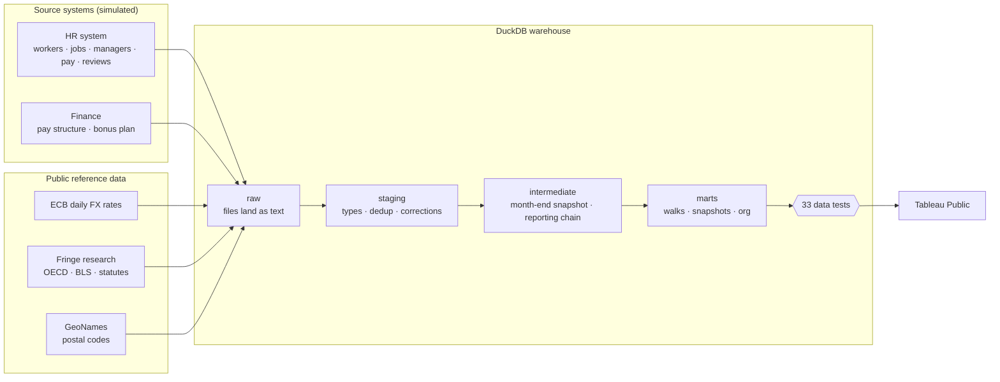
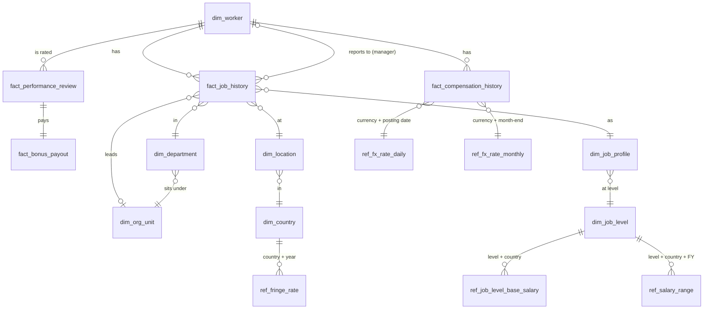

# People Analytics Warehouse


[](https://github.com/thialp/people-analytics-warehouse/actions/workflows/pipeline.yml)

An HR data warehouse for a fictional global company, built to answer the three questions every workforce review starts with, in SQL that reconciles exactly:

| Case study | Question | Dashboard |
|---|---|---|
| **1. [Workforce Cost Bridge](#1-business-problem)** | *Why did our workforce cost change?* A monthly walk of annualized pay run-rate that splits every dollar of change into hires, terminations, transfers, promotions, demotions, tenure raises, mobility, FTE, fringe and currency, in **nominal** and **constant** currency, reconciled to the cent. | Tableau Public: *coming soon* |
| **2. [Headcount & FTE Walk](#case-study-2-headcount--fte-walk)** | *How did the workforce change, and why?* Opening + hires − leavers ± internal moves = closing, in headcount and FTE, reconciled for any department, country, job family or grade, plus a benchmark of three ways to store workforce history. | **[Executive Summary on Tableau Public](https://public.tableau.com/app/profile/thialp/viz/arcadia_headcount_fte_walk/ExecutiveSummary)** |
| **3. [Global Workforce Footprint](#case-study-3-global-workforce-footprint)** | *Where are our people, where are we growing, and how do people move between offices?* An office-level walk and an origin-to-destination relocation table, drawn as a four-layer Tableau map with `MAKEPOINT`, `MAKELINE` and `BUFFER`. | Tableau Public: *coming soon* |

All three case studies run on the same simulated company, the same effective-dated history and the same month-end snapshot, and share one look ([`docs/brand/`](docs/brand/README.md)).

**The company.** Arcadia Systems has 30,024 people in 35 offices across 22 countries and five regions, organized under a CEO, eight function heads, four sub-function heads and 31 department heads, with every person in one reporting line that ends at the CEO ([org chart](docs/org_chart.md)). Pay follows a 12-level ladder with a base salary per level and country, raises on each hire anniversary, promotions one level at a time and an annual bonus set by the performance rating. FX rates are the **real ECB daily reference rates** and fringe rates are **researched by country and year** from OECD, BLS and statutory sources ([organization and pay model](docs/organization_and_pay_model.md)).

> **All data is synthetic.** Arcadia Systems is a fictional company. The data was generated from scratch by the simulation in [`generator/`](generator/). No real company data, people or pay is used. The business problems are common ones in enterprise HR and Finance analytics; the design, rules and code here are my own.

| | |
|---|---|
| **Stack** | SQL (DuckDB and SQL Server) · Python · Tableau · Docker · GitHub Actions |
| **Scale** | 43,569 workers ever employed (25,014 → 30,024) · 4 fiscal years · 49 month-ends · 35 offices · 22 countries · 17 currencies · 1,347,949 worker-month snapshots |
| **Output** | Nine Tableau-ready marts and seven dimension files in [`data/marts/`](data/marts/) |
| **Controls** | 33 automated data tests; the build stops if any fails |

---

> Sections 1 to 10 cover case study 1, the Workforce Cost Bridge. [Case study 2](#case-study-2-headcount--fte-walk) and [case study 3](#case-study-3-global-workforce-footprint) follow them.

## 1. Business problem

Finance sees that the annual pay run-rate rose **$152.6M (+5.0%) in FY2026**, from $3,042.9M to $3,195.5M. The number alone doesn't help anyone decide anything. Leaders need to know:

- How much came from **more people** versus **paying people more**?
- How much was **promotions** versus **tenure raises**?
- How much was real growth versus **currency movement** that will reverse on its own?
- Which **departments** drove it, and did **transfers** or a **reorganization** shift cost between them?

Answering this needs history that is effective-dated, systems that disagree, multi-currency pay, and a method where the pieces add back to the total exactly.

## 2. Data architecture



| Layer | What happens there | Files |
|---|---|---|
| **raw** | CSVs load as text, untouched, like a landing zone | [`data/raw/`](data/raw/) |
| **staging** | Data types set; same-day pay corrections resolved; job level renamed `grade` once | [`sql/01_staging/`](sql/01_staging/) |
| **intermediate** | Pay valued at its posting-date FX rate; effective-dated history turned into one row per worker per month-end; the reporting chain walked to the CEO | [`sql/02_intermediate/`](sql/02_intermediate/) |
| **marts** | Business-ready tables for Tableau | [`sql/03_marts/`](sql/03_marts/) |
| **tests** | Each test returns rule-breaking rows; zero rows = pass | [`tests/`](tests/) |

## 3. Analytical challenges

| Challenge | Why it's hard | How it's handled |
|---|---|---|
| **Effective-dated history** | Job and pay records each change on their own dates (SCD Type 2). A month-end view needs the record in effect *on that day*. | As-of join per month-end in [`int_worker_month_end_snapshot`](sql/02_intermediate/int_worker_month_end_snapshot.sql) |
| **Corrections in the source** | A pay correction adds a second row with the same effective date. Summing both double-counts the worker. | Keep the latest entry per worker + date; flag it `was_corrected` |
| **Multi-currency pay** | Pay is held in 17 local currencies. A stronger pound raises USD cost with no one getting a raise. | Real ECB rates, three ways: revalued at each month-end (nominal), booked at the posting date of each pay record, and at one constant rate set (2026-06-30) |
| **Reporting hierarchy** | "Everyone in Maria's organization" is a recursive question, and it changes every time a manager leaves or a team is split. | Manager on every effective-dated job record; a recursive CTE builds a closure table (worker × every manager above) per month-end, so an org roll-up is one equality join ([`int_worker_reporting_chain`](sql/02_intermediate/int_worker_reporting_chain.sql)) |
| **Fringe that changes by law** | Employer charges differ by country and change on January 1 (the UK raised employer NIC in 2025; Australia's super guarantee rises every July). | A researched rate per country and calendar year with its components and sources, joined on the year of each month-end |
| **Transfers between departments** | If movers are valued at new pay on the way in and old pay on the way out, transfers stop netting to zero for the company. | Transfers move at **prior** pay; any raise shows up as its own driver in the new department |
| **Order of attribution** | A worker can get promoted *and* see FX move in the same month. The split must not double-count. | A telescoping decomposition whose terms always sum exactly to the change ([§6](#6-key-calculations)) |
| **Privacy** | Pay for groups under 5 people can identify individuals, and what counts as a group depends on how a dashboard slices the data. | Suppression applied in Tableau at the level of the view; executive officers excluded in SQL |

## 4. Technical approach

1. **Simulate the company.** [`generator/generate_data.py`](generator/generate_data.py) runs four years of workforce history, applying each month's events in date order: hiring toward a growth target, attrition shaped by tenure, level and rating, raises on every hire anniversary, an annual June review with bonuses and July promotions (and rare demotions), off-cycle promotions, market adjustments, transfers (10% international, with pay re-levelled for the new market), FTE changes, office moves and the opening of six new offices. The org is kept valid every day: when a manager leaves, a successor or the next manager up takes the team the next day; teams over 9 are split by appointing a new manager. Two events give the history a story: a **FY24 restructuring** in Commercial and Marketing, and a **FY25 reorganization** that moved data teams into a new *Data & AI Platform* department.
2. **Land it as a warehouse would.** Twenty raw tables, with deliberate source quirks: same-day corrections, compensation history that only starts at a 2022 system conversion, FX that exists only on ECB business days, and a pegged currency.
3. **Model in layers** with plain SQL files in run order, so each step can be read and tested on its own.
4. **Test everything that must be true**, and fail the build if it isn't.
5. **Export flat marts** that Tableau Public can read directly.

## 5. Data model



| Raw table | Grain | Rows |
|---|---|---:|
| `dim_worker` | worker (fictional names) | 43,569 |
| `fact_job_history` | worker × effective-dated job record (SCD2), with manager and leadership role | 89,240 |
| `fact_compensation_history` | worker × effective-dated pay record (SCD2), incl. corrections | 153,830 |
| `fact_performance_review` | worker × fiscal year rating | 131,639 |
| `fact_bonus_payout` | worker × fiscal year bonus | 131,639 |
| `dim_org_unit` | company, functions, sub-functions, departments | 44 |
| `dim_department` | department, with function and sub-function | 32 |
| `dim_location` | office: fictional street, real postal code, GeoNames coordinates | 35 |
| `dim_country` | country, with region, currency and pay index | 22 |
| `dim_job_level` | level L1–L12 with the US base salary | 12 |
| `dim_job_profile` | job family × level (IC and people-manager variants) | 165 |
| `ref_job_level_base_salary` | level × country, in local currency | 264 |
| `ref_tenure_increase` | completed years of service → anniversary raise | 7 |
| `ref_performance_bonus` | rating → bonus % | 3 |
| `ref_salary_range` | fiscal year × level × country | 1,320 |
| `ref_fx_rate_daily` | currency × ECB publication day (2022-01 to 2026-09) | 20,434 |
| `ref_fx_rate_monthly` | currency × month-end | 833 |
| `ref_fx_rate_constant` | currency (latest close, 2026-06-30) | 17 |
| `ref_fringe_rate` | country × calendar year, with components | 110 |
| `ref_fringe_source` | country × year × component × source | 180 |

Full column definitions: [`docs/data_dictionary.md`](docs/data_dictionary.md).

## 6. Key calculations

**Measures are annualized run-rates at each month-end** (not monthly spend):

```
base   = annual base salary (full-time rate, local) × FTE × FX
loaded = base × (1 + fringe rate)
```

**The walk.** For each department and month:

```
Opening Run-Rate
  + Hires  − Terminations  + Transfers In  − Transfers Out
  + Promotions  − Demotions  + Tenure & Market Adjustments  + International Mobility
  + FTE Changes  + Fringe Rate Changes  + FX Rate Changes
= Closing Run-Rate
```

**Splitting a continuing worker's change.** With `B` = local salary, `F` = FTE, `X` = USD per local unit, `R` = fringe rate, `0` = prior month-end, `1` = current month-end, and `X1p` = the current currency at the prior month-end rate:

```
pay    = (B1·X1p − B0·X0) · F0 · (1 + R0)
FTE    =  B1·X1p · (F1 − F0) · (1 + R0)
fringe =  B1·X1p · F1 · (R1 − R0)
FX     =  B1 · F1 · (1 + R1) · (X1 − X1p)
```

The four terms telescope, so they always sum to exactly `value₁ − value₀`. In constant currency `X` never moves and the FX term is zero by construction. The pay term is labelled **International Mobility** when the country changed, **Promotions** when the job level went up, **Demotions** when it went down, and **Tenure & Market Adjustments** otherwise (anniversary raises, market adjustments, same-country office moves).

A worked example with real rows from the data is in [`docs/methodology.md`](docs/methodology.md). The SQL is [`mart_workforce_cost_bridge.sql`](sql/03_marts/mart_workforce_cost_bridge.sql).

## 7. Validation strategy

Every test is a SQL query that returns the rows breaking a rule. The pipeline runs all of them after every build and refuses to export if any returns rows.

| # | Test | Guards against |
|---|---|---|
| 01 | Worker IDs are unique | Duplicate people |
| 02 | Job history has no gaps or overlaps | Workers dropping out of, or doubling in, snapshots |
| 03 | Pay history has no gaps or overlaps after corrections | Double-counted pay from correction rows |
| 04 | Job records sit inside employment dates | Records before hire or after termination |
| 05 | One snapshot row per worker per month | Fan-out from the as-of joins |
| 06 | Every snapshot row has pay, FX, fringe and range | Dollars silently dropped by a missing lookup |
| 07 | **Opening + drivers = Closing**, every department and month | A walk that doesn't reconcile |
| 08 | Closing of one month = opening of the next | Breaks when walking across a date range |
| 09 | Walk closing = snapshot mart total | Two marts telling different stories |
| 10 | Transfers net to zero company-wide | Transfers creating or destroying cost |
| 11 | Constant currency has no FX effect | FX leaking into constant-currency figures |
| 12 | Executive officers excluded | Restricted pay in reporting |
| 13 | **Opening + movements = Closing** for every slice and month, in headcount and FTE | A headcount walk that doesn't reconcile |
| 14 | Headcount closing of one month = opening of the next, slice by slice | Breaks when walking across a date range |
| 15 | Walk opening and closing = an independent count of the month-end snapshot | Dropped or double-counted people |
| 16 | Internal moves net to zero company-wide, for every reason | Moves creating or destroying headcount |
| 17 | Hires and leavers = a recount from the worker master's hire and termination dates | Snapshot logic drifting from the source of truth |
| 18 | One movement row per worker per month | A worker counted twice in one month |
| 19 | **Opening + hires − leavers ± relocations = Closing** for every office and month | An office walk that doesn't reconcile |
| 20 | Offices add up to the company headcount walk: opening, hires, leavers by type, closing headcount and FTE | The map and the walk telling different stories |
| 21 | Relocations net to zero company-wide every month | Relocations creating or destroying people |
| 22 | Flows out of and into each office equal its relocations; no self-loops; every office has coordinates | Map lines that don't match the numbers, or offices missing from the map |
| 23 | Part-time headcount (workers under 1.0 FTE) at every month's opening and closing equals a recount from the worker-level table, and opening equals the prior closing | A part-time count that drifts from the workers it describes |
| 24 | **Everyone except the CEO reports to a manager employed that day**; exactly one CEO, with no manager | People with no manager, or reporting to someone who has left |
| 25 | Managers outrank people managers; ICs report at their level or higher; non-leaders report inside their department | Inverted or cross-department reporting lines |
| 26 | Every reporting chain ends at the CEO in under 15 steps | Loops and dead ends in the hierarchy |
| 27 | Every org unit has exactly one leader every month-end | Leaderless or double-led departments |
| 28 | Every country has a fringe rate for every year 2022–2026; components add up; every component cites a source | Missing, inconsistent or unsourced fringe rates |
| 29 | Every pay record finds an ECB rate posted ≤ 5 days before it; month-end rates are complete; the constant set equals its own date's rates | Stale or missing FX |
| 30 | Bonus % matches the rating; amount = base × FTE × % × proration; one review per year; forfeited only when the person left first | A bonus plan applied wrongly |
| 31 | Level changes only through promotion, demotion, succession or the reorg; a promotion is exactly one level up | Silent level jumps |
| 32 | Offices have valid coordinates and a real postal code (except the UAE, which has none); nobody sits in an office before it opened | Unmappable offices, impossible history |
| 33 | Tenure raises land on the hire anniversary and never exceed the schedule | Pay growth that the tenure table doesn't explain |

The tests were checked against deliberately broken builds:

| Break introduced | Tests that fail |
|---|---|
| Correction logic removed from staging | 11 tests, including 03, 05, 09 and 17 |
| Workers treated as gone on their last day worked (termination off by one day) | 17, 24, 27 |
| 1% of manager links dropped | 24, 26 |
| Job level raised by one on 0.1% of records | 25, 31 |
| One fringe rate moved by 1 point without its component | 28 |

## 8. Results

Company-wide walk of **loaded** run-rate by fiscal year, USD millions (executive officers excluded):

| Driver | FY23 | FY24 | FY25 | FY26 |
|---|---:|---:|---:|---:|
| **Opening run-rate** | **2,577.8** | **2,811.0** | **2,866.2** | **3,042.9** |
| Hires | +466.3 | +301.3 | +307.6 | +451.7 |
| Terminations | −371.3 | −340.8 | −321.6 | −378.4 |
| Transfers in / out (net) | 0.0 | 0.0 | 0.0 | 0.0 |
| Promotions | +17.4 | +19.2 | +21.2 | +22.0 |
| Demotions | −0.6 | −0.8 | −1.0 | −0.7 |
| Tenure & market adjustments | +100.6 | +108.0 | +105.8 | +105.1 |
| International mobility | −0.8 | −0.0 | −1.1 | +0.7 |
| FTE changes | −8.9 | −9.3 | −10.5 | −12.3 |
| Fringe rate changes | −2.6 | +2.6 | +5.9 | +9.0 |
| FX rate changes | +33.0 | −24.9 | +70.4 | −44.4 |
| **Closing run-rate** | **2,811.0** | **2,866.2** | **3,042.9** | **3,195.5** |
| Closing in constant currency | 2,816.7 | 2,897.3 | 3,000.1 | 3,195.5 |

What the walk says:

- **FY26 growth was mostly pay, not people.** Tenure raises and promotions added $126.4M; net hiring added $73.3M. Currency took back $44.4M as the euro, rupee and other currencies weakened against the dollar, which a constant-currency budget would never see.
- **Tenure raises are the steady engine.** About $100–108M every year, roughly 3.7% of the opening run-rate, whatever happens to hiring.
- **FY24 was the restructuring year.** Hires fell to 3,508 and terminations nearly matched them, so headcount grew by only 266. Run-rate still grew $55.2M because anniversary raises kept going.
- **Fringe moves with the law.** The UK's 2025 employer NIC increase, Australia's annual superannuation steps and Ireland's 2026 pension auto-enrolment show up as fringe-rate changes in the January they take effect.
- **FY25's transfers nearly doubled** (2,295 vs. about 1,300 in other years) because of the reorganization into Data & AI Platform: a large move between departments with zero company-level effect, as test 10 checks.
- **Constant currency equals nominal at FY26 close** because the constant rate set is the 2026-06-30 ECB rates, which test 11 checks.

## 9. Tableau visualization

The two marts are built for Tableau and connect directly from Tableau Public:

| Mart | Grain | Answers |
|---|---|---|
| [`mart_workforce_cost_bridge.csv`](data/marts/mart_workforce_cost_bridge.csv) | month × department × driver | *Why* did cost change? Waterfall by driver, filterable by department and period, with nominal/constant and base/loaded switches |
| [`mart_workforce_cost_snapshot.csv`](data/marts/mart_workforce_cost_snapshot.csv) | month × department × country × grade × job family | *Where* is the cost? Mix, trend, compa-ratio and FX impact by country |
| [`mart_fringe_rate.csv`](data/marts/mart_fringe_rate.csv) | country × calendar year | The researched fringe rate and its components |
| [`mart_org_leader_summary.csv`](data/marts/mart_org_leader_summary.csv) | org leader × fiscal year-end | The org chart: leaders, direct and total reports |
| [`mart_reporting_line.csv`](data/marts/mart_reporting_line.csv) | worker × fiscal year-end | Manager, skip-level manager, department and function head for every person |

Step-by-step connection guide: [`docs/tableau_public_guide.md`](docs/tableau_public_guide.md). The headcount walk and the workforce map have their own guides, in [case study 2](#case-study-2-headcount--fte-walk) and [case study 3](#case-study-3-global-workforce-footprint).

## 10. Lessons learned

- **Decide what a transfer is worth before writing SQL.** Valuing movers at prior pay is a design decision, not a detail. It's what makes the company total of transfers exactly zero and keeps every raise visible as a driver.
- **Corrections are the most common way a pay total goes wrong.** Same-day correction rows look like valid records until two of them add up. Resolving them in staging, with a test that fails without the fix, is cheaper than finding the problem in a dashboard.
- **Pre-compute snapshots, then join on equality.** Joining every month to every record with a date range ("band join") is easy to write and slow at scale. Building one row per worker per month-end first lets the walk join on `worker_id + month_end_date`, which is fast and simple to test.
- **Put measure semantics in SQL, not in the BI tool.** Signs, opening and closing balances and constant currency live in the mart. Tableau only sums, so every dashboard gets the same answer.
- **A walk is only trusted if it reconciles where people look.** Booking every internal move out of one slice and into another, at prior FTE, makes the headcount walk tie for any department, country, grade or job family, not just for the company.
- **Store history at the grain questions are asked.** A daily scaffold answers month-end questions with 30 times the rows; a month-end snapshot built once is smaller, faster and simpler to test ([`docs/performance.md`](docs/performance.md)).
- **Constant currency needs one fixed rate set.** Re-basing the "constant" rate every year adds a fake FX jump at each year boundary. One rate set (here the latest close) keeps the comparison clean across all four years.
- **A hierarchy is data that has to be kept valid every day.** Storing the manager on each effective-dated job record and walking it once into a closure table turns "who rolls up to whom" into equality joins, and four tests make "everyone reports to someone" a checked fact rather than an assumption.
- **External reference data deserves the same rigor as internal data.** Each fringe component carries its source and a test refuses unsourced numbers; FX comes from the ECB file itself, not a hand-typed table.

---

## Case study 2: Headcount & FTE Walk

[](https://public.tableau.com/app/profile/thialp/viz/arcadia_headcount_fte_walk/ExecutiveSummary)

*The Executive Summary, shown here in FTE mode. **[Open the interactive dashboard on Tableau Public](https://public.tableau.com/app/profile/thialp/viz/arcadia_headcount_fte_walk/ExecutiveSummary)**: pick any From/To months and switch between headcount and FTE.*

### Business problem

"How many people do we have?" sounds simple until HR, Finance and Recruiting each bring a different number. A headcount walk settles it by explaining the change, not just the level:

```
Opening headcount
  + Hires
  − Voluntary terminations  − Involuntary terminations
  − Internal moves out  + Internal moves in
  ± FTE changes (FTE only)
= Closing headcount
```

Leaders need it to reconcile for **any** cut they ask for: a department, a country, a job family, a grade, or a combination, over any range of months. A walk that only ties at company level is not good enough, because the questions are always about a part of the company.

### Approach

| Step | Model | What it does |
|---|---|---|
| 1 | [`int_worker_month_end_snapshot`](sql/02_intermediate/int_worker_month_end_snapshot.sql) | One row per worker per month-end, from the effective-dated history (shared with case study 1) |
| 2 | [`int_worker_movement`](sql/02_intermediate/int_worker_movement.sql) | Compares every worker's state at two consecutive month-ends and classifies the change: hire, termination, internal move (with one reason) or no change, plus any FTE change |
| 3 | [`mart_headcount_fte_walk`](sql/03_marts/mart_headcount_fte_walk.sql) | Books each movement against a **slice** (department × country × job family × grade), then aggregates |
| 4 | `mart_dim_*` | Five small dimension files; the fact carries codes only, so the export is 15 MB instead of 57 MB |

**The design decision that makes it reconcile everywhere:** an internal move is booked *out of* the old slice and *into* the new one, at the worker's prior FTE. A promotion is then a move from grade 2 to grade 3 that nets to zero for the department; a transfer is a move between departments that nets to zero for the company. Any FTE change in the same month is booked separately as an FTE Change in the new slice, so moves never create or destroy FTE.

| Challenge | How it's handled |
|---|---|
| Several attributes change in one month | One reason is recorded, by precedence: department (Reorganization if a reorg action is on file, otherwise Transfer), then country, then grade, then job family |
| Termination date is the last day worked | A worker terminated on a month-end is still in that month's closing and leaves in the next month; test 17 recounts this from the worker master |
| Hired and gone within one month | Never visible at a month-end, so listed separately in [`int_worker_in_month_hire_and_exit`](sql/02_intermediate/int_worker_in_month_hire_and_exit.sql) rather than lost (none in this dataset) |
| Executive officers | Counted in headcount (they are excluded only where pay is shown) |

### Results

Company-wide headcount walk by fiscal year:

| Movement | FY23 | FY24 | FY25 | FY26 |
|---|---:|---:|---:|---:|
| **Opening** | **25,014** | **26,922** | **27,188** | **28,445** |
| Hires | +5,545 | +3,508 | +4,333 | +5,168 |
| Voluntary terminations | −2,935 | −2,262 | −2,463 | −2,843 |
| Involuntary terminations | −702 | −980 | −613 | −746 |
| Internal moves (in = out) | 3,100 | 3,388 | 4,552 | 3,623 |
| **Closing** | **26,922** | **27,188** | **28,445** | **30,024** |

- **FY26 grew 5.6%** (+1,579) on 5,168 hires against 3,589 leavers. Voluntary turnover was 9.7% annualized, highest in Commercial (14.4% including involuntary).
- **FY24's restructuring shows twice:** involuntary terminations rose to 980, the highest of the four years, and hires fell to 3,508, so headcount barely moved (+266).
- **FY25's internal moves jumped to 4,552** with the reorganization into Data & AI Platform: a large shift between departments with no effect on the company total, which test 16 checks every month.
- **FTE trails headcount by 619.3** at FY26 close (29,404.7 FTE for 30,024 people) because 2,213 of those people work part-time schedules. Reporting one without the other overstates capacity.

### Performance: choosing the grain of history

[`benchmarks/benchmark_headcount_walk.py`](benchmarks/benchmark_headcount_walk.py) compares three ways to build the walk, at the real size and at 10 times the size (435,690 workers). Full write-up: [`docs/performance.md`](docs/performance.md).

| Design (at 435,690 workers) | Rows stored | Fits Tableau Public? | Seconds |
|---|---:|---|---:|
| Daily scaffold (one row per worker per day) | 409,391,320 | no | 21.82 |
| As-of date-range join, recomputed for both month-ends | none | n/a | 5.66 |
| **Month-end snapshot built once, then an equality join** | **13,479,490** | **yes** | **4.03** (2.15 build + 1.88 walk) |

The daily scaffold stores 30 times more rows than the month-end snapshot and is far past Tableau Public's 15-million-row limit even at the real size (40.9M rows). The snapshot is built once and reused by every downstream model; after that, each walk runs three times faster than recomputing the date-range joins, and the two SQL designs return identical results.

### Tableau

**Published:** [Executive Summary on Tableau Public](https://public.tableau.com/app/profile/thialp/viz/arcadia_headcount_fte_walk/ExecutiveSummary).

| Part | What it does |
|---|---|
| Header | From / To month dropdowns, a Headcount \| FTE capsule toggle (parameter action on custom shapes), an info button that opens a definitions panel |
| KPI band | Five cards drawn as text on map layers (`MAKEPOINT`), so one sheet and one query draw every title, value and note; cards beside the waterfall follow the toggle and name their unit |
| Waterfall | A Gantt-bar walk whose title states the finding ("FY26: 5,168 hires outpaced 3,589 leavers, adding 1,579 people") and whose tooltip bridges people to FTE ("5,168 people = 5,125.2 FTE") |
| Trend | Closing headcount or FTE for every month-end, with the selected period shaded |
| Turnover by function | Voluntary + involuntary annualized turnover, groups under 20 people hidden, title naming the top function |

How it was built, with every worksheet, calculated field, color, position, tooltip and design decision: [`docs/executive_summary_build_book.md`](docs/executive_summary_build_book.md). The map-layer KPI technique has its own guide ([`docs/tableau_kpi_cards_guide.md`](docs/tableau_kpi_cards_guide.md), also as a [PDF](docs/tableau_kpi_cards_guide.pdf), with a [config workbook](docs/Arcadia_KPI_Cards_Config.xlsx)), and the original plan for the full workbook is in [`docs/tableau_headcount_walk_guide.md`](docs/tableau_headcount_walk_guide.md). Two more dashboards are planned on the same data: Movement Drivers and Diagnostics (a slice table with a **Walk Gap** control that must read 0).

---

## Case study 3: Global Workforce Footprint


*Static preview drawn from the marts by [`docs/brand/build/`](docs/brand/build/). The interactive dashboard is on Tableau Public (coming soon).*

### Business problem

Location strategy questions (where to hire next, which hubs are growing, whether people are moving toward engineering centers or away from headquarters) are usually answered from a country column. A country hides the difference between two offices in the same country, and it can't show movement. This case study answers them at the office level, with every number tied back to the headcount walk.

### Approach

| Model | What it does |
|---|---|
| [`int_worker_movement`](sql/02_intermediate/int_worker_movement.sql) | Now carries each worker's office at both month-ends |
| [`mart_location_headcount`](sql/03_marts/mart_location_headcount.sql) | One row per office per month: opening, hires, leavers by type, relocations in and out, closing (headcount and FTE) |
| [`mart_mobility_flows`](sql/03_marts/mart_mobility_flows.sql) | Origin and destination office for every relocation, with both ends' coordinates, so Tableau can draw `MAKELINE` without relating the location table twice |
| [`mart_dim_location`](sql/03_marts/mart_dim_location.sql) | 35 offices with real postal codes and their GeoNames coordinates (street addresses are fictional), plus the date each office opened |

A relocation is any change of office between two month-ends, including between two offices in the same country, which the slice-level walk in case study 2 can't see (Bengaluru to Hyderabad is the busiest corridor, and both are in India). Four tests (19 to 22) tie the office walk to the company walk and the flows to the office walk.

### Results (FY26)

| Finding | Number |
|---|---|
| Fastest-growing region | Middle East & Africa, +6.1% (1,037 → 1,100), against +5.6% company-wide; Europe next at +6.0% |
| Share in the three India engineering centers | 25% of the company (7,535 people in Bengaluru, Hyderabad and Pune), more than twice headquarters in Austin (3,107) |
| New offices | Six opened during the window; Pune, opened July 2024, reached 1,084 people in two years |
| Relocations | 392 people changed office; 135 moved between countries |
| Busiest corridor | Bengaluru ↔ Hyderabad, 55 people |
| Within 1,000 km of London | Paris, Amsterdam, Dublin, Zurich, Munich and Berlin: 3,903 people across seven offices, London included |

### Tableau

Step-by-step build: [`docs/tableau_workforce_map_guide.md`](docs/tableau_workforce_map_guide.md). One map with four layers (countries, relocation paths with `MAKELINE`, a `BUFFER` radius around the selected office, offices with `MAKEPOINT`), a parameter action that moves the radius when an office is clicked, `DISTANCE` to count the people inside it, and the 2025 viewport parameter and dynamic color range where Tableau Public supports them.

---

## Run it yourself

Requires Python 3.11+.

```bash
git clone https://github.com/thialp/people-analytics-warehouse.git
cd people-analytics-warehouse
pip install -r requirements.txt

python generator/generate_data.py      # optional: rebuild the raw data (same seed, same output)
python pipeline/run_pipeline.py        # build the warehouse, run tests, export marts and the org chart

python benchmarks/benchmark_headcount_walk.py   # optional: the grain benchmark (case study 2)
bash docs/brand/build/build.sh                  # optional: rebuild the logo and both dashboard previews (needs Node)
```

The warehouse is written to `warehouse/arcadia.duckdb`. Open it with the [DuckDB CLI](https://duckdb.org/docs/installation/) or any SQL client to explore the tables.

Every push runs the same build and tests on GitHub Actions ([`.github/workflows/pipeline.yml`](.github/workflows/pipeline.yml)).

## Run it on SQL Server with Tableau

The same warehouse also builds on **SQL Server** (in Docker) for a live Tableau connection, the way enterprise BI teams usually work:

- [`sqlserver/`](sqlserver/) holds T-SQL scripts that load the CSVs with `BULK INSERT` and build typed `dw` tables, the pay history in USD at its posting-date rate (`OUTER APPLY TOP 1` as the as-of join), an indexed worker month-end snapshot, a recursive reporting-chain table and three reporting views. The load script is generated from the CSV headers ([`make_load_raw.py`](sqlserver/make_load_raw.py)).
- [`tableau/custom_sql_workforce_cost_bridge.sql`](tableau/custom_sql_workforce_cost_bridge.sql) is the cost bridge as **Tableau Custom SQL**: one `SELECT` with no CTEs, using derived tables and `CROSS APPLY (VALUES …)` to unpivot each worker into walk lines.
- The bridge Custom SQL reproduces the DuckDB mart row for row, to the cent, and [`05_validate.sql`](sqlserver/05_validate.sql) checks the SQL Server build's row counts and control totals against the DuckDB values. Views and marts share column names, so a workbook can switch between SQL Server and the CSVs with *Replace Data Source*.

Step-by-step setup, with expected output at each step: [`docs/sql_server_local_setup.md`](docs/sql_server_local_setup.md).

Or bring up the whole environment with Docker Compose. [`compose.yaml`](compose.yaml) starts SQL Server, waits for its healthcheck and builds and validates the warehouse:

```bash
cp .env.example .env   # set your own password
docker compose up -d
```

Details: [`docs/docker_compose_guide.md`](docs/docker_compose_guide.md).

## Repository layout

```
├── generator/            synthetic company simulation, fringe research and FX loader (Python)
├── reference/            public reference data: ECB daily FX extract and the script that builds it
├── data/
│   ├── raw/              raw warehouse tables (CSV)
│   └── marts/            Tableau-ready outputs (CSV)
├── sql/                  DuckDB pipeline
│   ├── 01_staging/       typing, corrections
│   ├── 02_intermediate/  calendar, pay in USD, worker month-end snapshot, movement, reporting chain and line
│   └── 03_marts/         cost bridge, cost snapshot, headcount & FTE walk, office walk, mobility flows, org chart, fringe, dimensions
├── tests/                data-quality and reconciliation tests (SQL)
├── pipeline/             build runner and org chart writer
├── benchmarks/           grain benchmark for the headcount walk
├── sqlserver/            SQL Server (T-SQL) build: raw → dw → rpt, plus validation
├── compose.yaml          SQL Server + warehouse build as a Docker Compose stack
├── tableau/              Tableau Custom SQL and connection settings
└── docs/                 data dictionary, methodology, organization and pay model, org chart, Tableau, SQL Server and Docker guides
    └── brand/            Arcadia logo, color palettes (Tableau Preferences.tps), style rules
```

---

**Thiago Alpoin** · People Analytics · [LinkedIn](https://www.linkedin.com/in/thiagoalpoin) · [GitHub](https://github.com/thialp)
