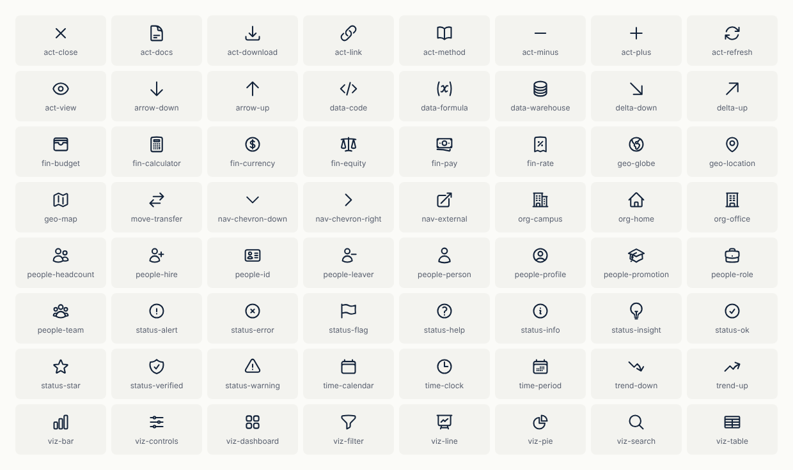

# Arcadia icons and Tableau shapes

64 line icons for the Arcadia dashboards, named by what they mean in a workforce report (`people-hire`, `move-transfer`, `status-ok`) rather than by what they look like. They are restyled from [Heroicons](https://heroicons.com) (MIT, © Tailwind Labs; see [`LICENSE-heroicons.txt`](LICENSE-heroicons.txt)) with a heavier 1.75 stroke, which holds up better at the 16 to 32 px sizes Tableau draws shapes at.



## Use them in Tableau Public

1. Download [`Arcadia_Tableau_Shapes.zip`](Arcadia_Tableau_Shapes.zip) (click **Download raw file**) and unzip it.
2. Move the folders into `Documents/My Tableau Public Repository/Shapes/`. Each folder becomes one shape palette.
3. In Tableau: Marks card → **Shape** → **More Shapes…** → **Reload Shapes**, then pick a palette from the dropdown and assign shapes.

| Folder | Use it for |
|---|---|
| Arcadia Mono | Shapes you color from the Color shelf. They are black on a transparent background, so Tableau can tint them. |
| Arcadia Navy, Arcadia Slate | Icons on cards and in tables |
| Arcadia White | Icons on the navy header band |
| Arcadia Teal, Arcadia Coral | Fixed up/down or pass/fail markers (teal = growth, coral = loss) |
| Arcadia Badge Navy, Teal, Coral, Violet | White icon on a rounded tile, for KPI cards and status columns |

Every PNG is 64 × 64 with a transparent background, so it stays sharp on high-DPI screens; use the Size slider to bring it down to 16–32 px. File names start with a group prefix, so Tableau's shape picker (which sorts by name) keeps related icons together. The same icons are components in the Figma UI kit, under Foundations › Icons.

## Groups

| Prefix | Icons |
|---|---|
| `people-`, `org-` | headcount, team, person, hire, leaver, profile, id, promotion, role · office, campus, home |
| `move-`, `trend-`, `delta-`, `arrow-` | transfer · up, down · up, down · up, down |
| `fin-` | currency, pay, equity, rate, calculator, budget |
| `geo-`, `time-` | globe, location, map · calendar, period, clock |
| `viz-`, `data-` | bar, pie, line, table, dashboard, filter, controls, search · warehouse, formula, code |
| `status-` | ok, warning, alert, error, info, help, verified, flag, insight, star |
| `nav-`, `act-` | chevron-down, chevron-right, external · download, refresh, docs, method, link, view, plus, minus, close |

The Heroicons source of each icon is in its SVG (`data-source="heroicons/…"`) and in the `ICONS` map in [`../build/icons.py`](../build/icons.py).

## Rebuild

```bash
cd docs/brand/build
python3 icons.py                                   # re-render the PNGs, zip and preview from svg/
python3 icons.py --import /path/to/heroicons       # refresh svg/ from a Heroicons checkout first
```

To add an icon, add a line to `ICONS` in `icons.py` and run the import.
