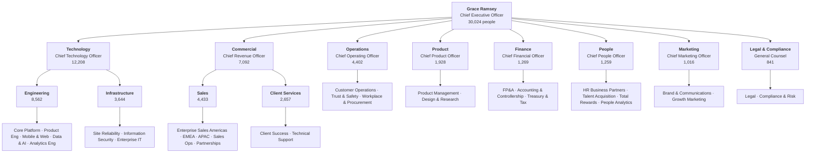

# Arcadia Systems: company profile

> **Arcadia Systems is not a real company.** Every person, office, salary, hire and resignation in this repository was **generated by Claude Code**, Anthropic's coding agent, working from a set of rules and random numbers I designed together with it. The only real data is public reference data: the ECB's daily exchange rates and published fringe-rate statistics (see [organization and pay model](organization_and_pay_model.md)). Any resemblance to a real company or person is a coincidence.
>
> I credit Claude Code on purpose. Simulating 43,569 people across 4 fiscal years, with effective-dated pay, promotions, transfers and relocations that all reconcile to the cent, is work I did *with* it, not by hand, and that is how I build analytics today.

## What Arcadia does

Arcadia Systems sells **Arcadia Cloud**, a platform that lets large enterprises run customer operations, data and security on one system. A bank, an airline or a retailer uses it to handle support cases, move data between systems, and detect fraud and abuse, without stitching together a dozen vendors.

The company is organized around that product:

| Function | What it does at Arcadia | People (Jun 2026) |
|---|---|---|
| **Technology** | Builds and runs the platform: core engineering, mobile and web, data and AI, site reliability, security, internal IT | 12,208 |
| **Commercial** | Sells and keeps customers: enterprise sales by region, client success, technical support, partnerships | 7,092 |
| **Operations** | Runs customer operations and trust & safety, plus workplace and procurement | 4,402 |
| **Product** | Product management, design and research | 1,928 |
| **Finance** | FP&A, accounting and controllership, treasury and tax | 1,269 |
| **People** | HR business partners, talent acquisition, total rewards, people analytics | 1,259 |
| **Marketing** | Brand and communications, growth marketing | 1,016 |
| **Legal & Compliance** | Legal, compliance and risk | 841 |

**Size:** 30,024 people on 2026-06-30 (25,014 four years earlier), 43,569 people employed at some point, 35 offices in 22 countries, 17 currencies. Fiscal year runs July to June.

## Where Arcadia is

Headquartered in **Austin, Texas**. The company was founded there in 2012, opened San Francisco and London in 2013 and New York in 2014, and has added offices almost every year since, mostly engineering centers where the talent is and regional hubs where the customers are.

| Region | Offices | People | Largest sites |
|---|---|---|---|
| North America | 8 | 10,196 | Austin HQ (3,107), New York (1,496), San Francisco (1,420), Seattle (1,144) |
| Asia Pacific | 9 | 9,803 | Bengaluru (3,510), Hyderabad (2,941), Singapore, Tokyo, Sydney, Seoul, Manila |
| Europe | 12 | 6,638 | London (1,416), Dublin, Berlin, Munich, Amsterdam, Warsaw, Krakow, Lisbon |
| Latin America | 3 | 2,287 | Sao Paulo (1,117), Mexico City, Guadalajara |
| Middle East & Africa | 3 | 1,100 | Dubai, Johannesburg, Cape Town |

Seven **engineering centers** (Bengaluru, Hyderabad, Pune, Warsaw, Krakow, Lisbon, Guadalajara), five **regional hubs** (London, Sao Paulo, Singapore, Dubai, Amsterdam), one **operations center** (Manila) and 21 offices, plus the headquarters. Pay follows the location through a pay-zone factor and a local currency, which is what makes the compensation and cost analyses interesting.

## Leadership org chart

Every one of the 30,024 people sits in a single reporting line that ends at the CEO. The top of the tree:

The structure is **CEO → 8 function heads → 4 sub-function heads (Technology and Commercial only) → 31 department heads → directors → managers → individual contributors**, with job levels L1 to L12. The full tree, with every department head and their direct and total headcount, is in the [detailed org chart](org_chart.md). It is regenerated from the warehouse by [`pipeline/build_org_chart.py`](../../pipeline/build_org_chart.py).

All names are invented. The people in the leadership chart and everyone below them were created by the simulation in [`generator/`](../../generator/).

## How the company is simulated

| Piece | How it is made | Where to read more |
|---|---|---|
| People, hires, exits, promotions, transfers, relocations | A seeded simulation: the same seed always produces the same company, checked by CI | [`generator/`](../../generator/) |
| Org structure and reporting lines | Rules for spans of control and levels, with managers assigned so every chain ends at the CEO | [organization and pay model](organization_and_pay_model.md) |
| Pay | Base salary per level and country, raises on hire anniversaries, one-level promotions, performance-based bonus | [organization and pay model](organization_and_pay_model.md) |
| Exchange rates | **Real** ECB daily reference rates | [`reference/`](../../reference/README.md) |
| Fringe rates | **Researched** by country and year from OECD, BLS and statutory sources | [`reference/`](../../reference/README.md) |

## What the data supports

The same company feeds every case study in this repository:

- [Workforce Cost Bridge](../projects/workforce-cost-bridge/methodology.md)
- [Headcount & FTE Walk](../projects/headcount-fte-walk/executive_summary_build_book.md)
- [Global Workforce Footprint](../projects/workforce-footprint/tableau_workforce_map_guide.md)
- [Compensation Walk](../projects/compensation-walk/compensation_walk.md)
