# Arcadia Systems: leadership org chart

As of **2026-06-30** (end of FY26): **30,024 people**, every one of them in a single
reporting line that ends at the CEO. Each box shows the leader, their level and two counts:
**direct** reports and **total** people in their organization (direct plus everyone below them).

> Arcadia Systems is fictional and all names are invented. Generated by
> [`pipeline/build_org_chart.py`](../../pipeline/build_org_chart.py) from `mart_org_leader_summary`.

```mermaid
flowchart LR
    ORG_000["<b>Grace Ramsey</b><br/>Chief Executive Officer<br/>8 direct · 30,023 total"]
    ORG_TEC["<b>Technology</b><br/>Marcus Carter, Chief Technology Officer<br/>2 direct · 12,208 total"]
    ORG_COM["<b>Commercial</b><br/>Isaac Porter, Chief Revenue Officer<br/>2 direct · 7,092 total"]
    ORG_OPS["<b>Operations</b><br/>Tyler Mercer, Chief Operating Officer<br/>3 direct · 4,402 total"]
    ORG_PRD["<b>Product</b><br/>Ava Carter, Chief Product Officer<br/>2 direct · 1,928 total"]
    ORG_FIN["<b>Finance</b><br/>Jordan Reed, Chief Financial Officer<br/>3 direct · 1,269 total"]
    ORG_PPL["<b>People</b><br/>Grace Ellis, Chief People Officer<br/>4 direct · 1,259 total"]
    ORG_MKT["<b>Marketing</b><br/>Isaac Barnes, Chief Marketing Officer<br/>2 direct · 1,016 total"]
    ORG_LGL["<b>Legal & Compliance</b><br/>Grace Warren, General Counsel<br/>2 direct · 841 total"]
    ORG_TEC_ENG["<b>Engineering</b><br/>Isaac Holland, SVP<br/>5 direct · 8,562 total"]
    ORG_COM_SAL["<b>Sales</b><br/>Hannah Dalton, SVP<br/>5 direct · 4,433 total"]
    ORG_TEC_INF["<b>Infrastructure</b><br/>Marcus Hayes, SVP<br/>3 direct · 3,644 total"]
    ORG_COM_CLS["<b>Client Services</b><br/>Noah Bennett, SVP<br/>2 direct · 2,657 total"]
    D_101["<b>Core Platform Engineering</b><br/>Caleb Barnes, L9<br/>9 direct · 2,654 total"]
    D_801["<b>Customer Operations</b><br/>Jasmine Kobayashi, L9<br/>7 direct · 2,341 total"]
    D_102["<b>Product Engineering</b><br/>Claire Garrett, L9<br/>9 direct · 2,207 total"]
    D_103["<b>Mobile & Web Engineering</b><br/>Isha Wong, L9<br/>8 direct · 1,843 total"]
    D_802["<b>Trust & Safety Operations</b><br/>Kayla Mercer, L9<br/>8 direct · 1,474 total"]
    D_305["<b>Client Success</b><br/>Isaac Coleman, L9<br/>5 direct · 1,470 total"]
    D_108["<b>Data & AI Platform</b><br/>Grace Dawson, L9<br/>9 direct · 1,405 total"]
    D_106["<b>Information Security</b><br/>Chen Agarwal, L8<br/>9 direct · 1,353 total"]
    D_301["<b>Enterprise Sales - Americas</b><br/>Olivia Lowell, L9<br/>5 direct · 1,350 total"]
    D_105["<b>Site Reliability</b><br/>Riley Hayes, L9<br/>9 direct · 1,247 total"]
    D_306["<b>Technical Support</b><br/>Noah Carter, L9<br/>4 direct · 1,185 total"]
    D_201["<b>Product Management</b><br/>Dylan Jennings, L9<br/>7 direct · 1,183 total"]
    D_302["<b>Enterprise Sales - EMEA</b><br/>Chloe Holland, L9<br/>3 direct · 1,079 total"]
    D_107["<b>Enterprise IT</b><br/>Grace Ramsey, L8<br/>9 direct · 1,041 total"]
    D_303["<b>Enterprise Sales - APAC</b><br/>Owen Brooks, L8<br/>9 direct · 931 total"]
    D_202["<b>Design & Research</b><br/>Noah Quinlan, L8<br/>9 direct · 743 total"]
    D_803["<b>Workplace & Procurement</b><br/>Sydney Vaughn, L8<br/>9 direct · 584 total"]
    D_402["<b>Growth Marketing</b><br/>Nora Osborne, L8<br/>9 direct · 583 total"]
    D_304["<b>Sales Operations</b><br/>Ethan Yates, L8<br/>8 direct · 549 total"]
    D_502["<b>Accounting & Controllership</b><br/>Isaac Baxter, L8<br/>7 direct · 523 total"]
    D_307["<b>Partnerships</b><br/>Claire Coleman, L8<br/>9 direct · 519 total"]
    D_702["<b>Compliance & Risk</b><br/>Grace Santos, L8<br/>9 direct · 507 total"]
    D_501["<b>FP&A</b><br/>Sophia Carter, L8<br/>7 direct · 456 total"]
    D_602["<b>Talent Acquisition</b><br/>Zoe Garrett, L8<br/>8 direct · 455 total"]
    D_104["<b>Analytics Engineering</b><br/>Marcus Thornton, L8<br/>8 direct · 448 total"]
    D_401["<b>Brand & Communications</b><br/>James Whitaker, L8<br/>7 direct · 431 total"]
    D_601["<b>HR Business Partners</b><br/>Karim Khalil, L8<br/>9 direct · 378 total"]
    D_701["<b>Legal</b><br/>Maria Harmon, L7<br/>19 direct · 332 total"]
    D_503["<b>Treasury & Tax</b><br/>Marcus Prescott, L7<br/>14 direct · 287 total"]
    D_603["<b>Total Rewards</b><br/>Chloe Baxter, L7<br/>11 direct · 214 total"]
    D_604["<b>People Analytics</b><br/>Owen Prescott, L7<br/>13 direct · 208 total"]
    ORG_000 --> ORG_TEC
    ORG_000 --> ORG_COM
    ORG_000 --> ORG_OPS
    ORG_000 --> ORG_PRD
    ORG_000 --> ORG_FIN
    ORG_000 --> ORG_PPL
    ORG_000 --> ORG_MKT
    ORG_000 --> ORG_LGL
    ORG_TEC --> ORG_TEC_ENG
    ORG_COM --> ORG_COM_SAL
    ORG_TEC --> ORG_TEC_INF
    ORG_COM --> ORG_COM_CLS
    ORG_TEC_ENG --> D_101
    ORG_OPS --> D_801
    ORG_TEC_ENG --> D_102
    ORG_TEC_ENG --> D_103
    ORG_OPS --> D_802
    ORG_COM_CLS --> D_305
    ORG_TEC_ENG --> D_108
    ORG_TEC_INF --> D_106
    ORG_COM_SAL --> D_301
    ORG_TEC_INF --> D_105
    ORG_COM_CLS --> D_306
    ORG_PRD --> D_201
    ORG_COM_SAL --> D_302
    ORG_TEC_INF --> D_107
    ORG_COM_SAL --> D_303
    ORG_PRD --> D_202
    ORG_OPS --> D_803
    ORG_MKT --> D_402
    ORG_COM_SAL --> D_304
    ORG_FIN --> D_502
    ORG_COM_SAL --> D_307
    ORG_LGL --> D_702
    ORG_FIN --> D_501
    ORG_PPL --> D_602
    ORG_TEC_ENG --> D_104
    ORG_MKT --> D_401
    ORG_PPL --> D_601
    ORG_LGL --> D_701
    ORG_FIN --> D_503
    ORG_PPL --> D_603
    ORG_PPL --> D_604
    classDef company fill:#0F2A44,color:#FFFFFF,stroke:#0F2A44
    classDef function fill:#1F5C99,color:#FFFFFF,stroke:#1F5C99
    classDef sub fill:#DCE8F5,color:#0F2A44,stroke:#1F5C99
    classDef dept fill:#FFFFFF,color:#0F2A44,stroke:#9DB4CC
    class ORG_000 company
    class ORG_TEC,ORG_COM,ORG_OPS,ORG_PRD,ORG_FIN,ORG_PPL,ORG_MKT,ORG_LGL function
    class ORG_TEC_ENG,ORG_COM_SAL,ORG_TEC_INF,ORG_COM_CLS sub
    class D_101,D_801,D_102,D_103,D_802,D_305,D_108,D_106,D_301,D_105,D_306,D_201,D_302,D_107,D_303,D_202,D_803,D_402,D_304,D_502,D_307,D_702,D_501,D_602,D_104,D_401,D_601,D_701,D_503,D_603,D_604 dept
```

## Leaders

| Unit | Type | Leader | Role | Level | Office | Direct | Total |
|---|---|---|---|---:|---|---:|---:|
| Arcadia Systems | Company | Grace Ramsey | Chief Executive Officer | L12 | Austin HQ | 8 | 30,023 |
| Technology | Function | Marcus Carter | Chief Technology Officer | L11 | Austin HQ | 2 | 12,208 |
| Commercial | Function | Isaac Porter | Chief Revenue Officer | L11 | Austin HQ | 2 | 7,092 |
| Operations | Function | Tyler Mercer | Chief Operating Officer | L11 | Austin HQ | 3 | 4,402 |
| Product | Function | Ava Carter | Chief Product Officer | L11 | Austin HQ | 2 | 1,928 |
| Finance | Function | Jordan Reed | Chief Financial Officer | L11 | Austin HQ | 3 | 1,269 |
| People | Function | Grace Ellis | Chief People Officer | L10 | Austin HQ | 4 | 1,259 |
| Marketing | Function | Isaac Barnes | Chief Marketing Officer | L10 | Austin HQ | 2 | 1,016 |
| Legal & Compliance | Function | Grace Warren | General Counsel | L10 | Austin HQ | 2 | 841 |
| Engineering | Sub-function | Isaac Holland | Senior Vice President, Engineering | L10 | Austin HQ | 5 | 8,562 |
| Sales | Sub-function | Hannah Dalton | Senior Vice President, Sales | L10 | Austin HQ | 5 | 4,433 |
| Infrastructure | Sub-function | Marcus Hayes | Senior Vice President, Infrastructure | L10 | Austin HQ | 3 | 3,644 |
| Client Services | Sub-function | Noah Bennett | Senior Vice President, Client Services | L10 | Austin HQ | 2 | 2,657 |
| Core Platform Engineering | Department | Caleb Barnes | Head of Core Platform Engineering | L9 | Atlanta | 9 | 2,654 |
| Customer Operations | Department | Jasmine Kobayashi | Head of Customer Operations | L9 | Hyderabad | 7 | 2,341 |
| Product Engineering | Department | Claire Garrett | Head of Product Engineering | L9 | Austin HQ | 9 | 2,207 |
| Mobile & Web Engineering | Department | Isha Wong | Head of Mobile & Web Engineering | L9 | Hyderabad | 8 | 1,843 |
| Trust & Safety Operations | Department | Kayla Mercer | Head of Trust & Safety Operations | L9 | San Francisco | 8 | 1,474 |
| Client Success | Department | Isaac Coleman | Head of Client Success | L9 | New York | 5 | 1,470 |
| Data & AI Platform | Department | Grace Dawson | Head of Data & AI Platform | L9 | Chicago | 9 | 1,405 |
| Information Security | Department | Chen Agarwal | Head of Information Security | L8 | Hyderabad | 9 | 1,353 |
| Enterprise Sales - Americas | Department | Olivia Lowell | Head of Enterprise Sales - Americas | L9 | Toronto | 5 | 1,350 |
| Site Reliability | Department | Riley Hayes | Head of Site Reliability | L9 | San Francisco | 9 | 1,247 |
| Technical Support | Department | Noah Carter | Head of Technical Support | L9 | San Francisco | 4 | 1,185 |
| Product Management | Department | Dylan Jennings | Head of Product Management | L9 | New York | 7 | 1,183 |
| Enterprise Sales - EMEA | Department | Chloe Holland | Head of Enterprise Sales - EMEA | L9 | Austin HQ | 3 | 1,079 |
| Enterprise IT | Department | Grace Ramsey | Head of Enterprise IT | L8 | Chicago | 9 | 1,041 |
| Enterprise Sales - APAC | Department | Owen Brooks | Head of Enterprise Sales - APAC | L8 | Chicago | 9 | 931 |
| Design & Research | Department | Noah Quinlan | Head of Design & Research | L8 | Chicago | 9 | 743 |
| Workplace & Procurement | Department | Sydney Vaughn | Head of Workplace & Procurement | L8 | New York | 9 | 584 |
| Growth Marketing | Department | Nora Osborne | Head of Growth Marketing | L8 | Austin HQ | 9 | 583 |
| Sales Operations | Department | Ethan Yates | Head of Sales Operations | L8 | New York | 8 | 549 |
| Accounting & Controllership | Department | Isaac Baxter | Head of Accounting & Controllership | L8 | Austin HQ | 7 | 523 |
| Partnerships | Department | Claire Coleman | Head of Partnerships | L8 | Austin HQ | 9 | 519 |
| Compliance & Risk | Department | Grace Santos | Head of Compliance & Risk | L8 | Singapore | 9 | 507 |
| FP&A | Department | Sophia Carter | Head of FP&A | L8 | San Francisco | 7 | 456 |
| Talent Acquisition | Department | Zoe Garrett | Head of Talent Acquisition | L8 | Austin HQ | 8 | 455 |
| Analytics Engineering | Department | Marcus Thornton | Head of Analytics Engineering | L8 | New York | 8 | 448 |
| Brand & Communications | Department | James Whitaker | Head of Brand & Communications | L8 | Austin HQ | 7 | 431 |
| HR Business Partners | Department | Karim Khalil | Head of HR Business Partners | L8 | Johannesburg | 9 | 378 |
| Legal | Department | Maria Harmon | Head of Legal | L7 | New York | 19 | 332 |
| Treasury & Tax | Department | Marcus Prescott | Head of Treasury & Tax | L7 | Seattle | 14 | 287 |
| Total Rewards | Department | Chloe Baxter | Head of Total Rewards | L7 | Austin HQ | 11 | 214 |
| People Analytics | Department | Owen Prescott | Head of People Analytics | L7 | San Francisco | 13 | 208 |

Direct reports of a department head include their directors and managers and, in smaller departments,
individual contributors. A total counts everyone below a leader, so a function head's total equals the
totals of its department heads plus the department and sub-function heads themselves.
