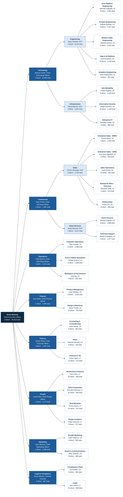

# Arcadia Systems: leadership org chart

As of **2026-06-30** (end of FY26): **30,014 people**, every one of them in a single
reporting line that ends at the CEO. Each box shows the leader, their level and two counts:
**direct** reports and **total** people in their organization (direct plus everyone below them).

> Arcadia Systems is fictional and all names are invented. Generated by
> [`pipeline/build_org_chart.py`](../../pipeline/build_org_chart.py) from `mart_org_leader_summary`.

```mermaid
flowchart LR
    ORG_000["<b>Grace Ramsey</b><br/>Chief Executive Officer<br/>8 direct · 30,013 total"]
    ORG_TEC["<b>Technology</b><br/>Marcus Carter, Chief Technology Officer<br/>2 direct · 11,500 total"]
    ORG_COM["<b>Commercial</b><br/>Isaac Porter, Chief Revenue Officer<br/>2 direct · 7,802 total"]
    ORG_OPS["<b>Operations</b><br/>Tyler Mercer, Chief Operating Officer<br/>3 direct · 4,314 total"]
    ORG_PRD["<b>Product</b><br/>Ava Carter, Chief Product Officer<br/>2 direct · 1,985 total"]
    ORG_FIN["<b>Finance</b><br/>Jordan Reed, Chief Financial Officer<br/>3 direct · 1,267 total"]
    ORG_PPL["<b>People</b><br/>Grace Ellis, Chief People Officer<br/>4 direct · 1,174 total"]
    ORG_MKT["<b>Marketing</b><br/>Isaac Barnes, Chief Marketing Officer<br/>2 direct · 1,096 total"]
    ORG_LGL["<b>Legal & Compliance</b><br/>Grace Warren, General Counsel<br/>2 direct · 867 total"]
    ORG_TEC_ENG["<b>Engineering</b><br/>Isaac Holland, SVP<br/>5 direct · 8,101 total"]
    ORG_COM_SAL["<b>Sales</b><br/>James Jennings, SVP<br/>8 direct · 4,753 total"]
    ORG_TEC_INF["<b>Infrastructure</b><br/>Maria Barnes, SVP<br/>3 direct · 3,397 total"]
    ORG_COM_CLS["<b>Client Services</b><br/>Noah Bennett, SVP<br/>2 direct · 3,047 total"]
    D_101["<b>Core Platform Engineering</b><br/>Hannah Caldwell, L9<br/>9 direct · 2,591 total"]
    D_801["<b>Customer Operations</b><br/>Tyler Garrett, L9<br/>9 direct · 2,380 total"]
    D_102["<b>Product Engineering</b><br/>Nathan Quinlan, L9<br/>9 direct · 2,157 total"]
    D_103["<b>Mobile & Web Engineering</b><br/>Daniela Guerra, L9<br/>9 direct · 1,851 total"]
    D_305["<b>Client Success</b><br/>Wesley Hughes, L9<br/>5 direct · 1,668 total"]
    D_802["<b>Trust & Safety Operations</b><br/>Tatiana Guerra, L9<br/>9 direct · 1,399 total"]
    D_306["<b>Technical Support</b><br/>Amelie Gallagher, L9<br/>4 direct · 1,377 total"]
    D_105["<b>Site Reliability</b><br/>Chloe Hughes, L8<br/>9 direct · 1,240 total"]
    D_201["<b>Product Management</b><br/>Leah Shelton, L8<br/>9 direct · 1,232 total"]
    D_302["<b>Enterprise Sales - EMEA</b><br/>Ursula Rossi, L8<br/>7 direct · 1,186 total"]
    D_106["<b>Information Security</b><br/>Diego Pacheco, L8<br/>10 direct · 1,164 total"]
    D_108["<b>Data & AI Platform</b><br/>Liam Emerson, L8<br/>12 direct · 1,140 total"]
    D_107["<b>Enterprise IT</b><br/>Brandon Porter, L8<br/>8 direct · 990 total"]
    D_303["<b>Enterprise Sales - APAC</b><br/>Seo-yeon Agarwal, L8<br/>8 direct · 903 total"]
    D_202["<b>Design & Research</b><br/>Owen Foster, L8<br/>10 direct · 751 total"]
    D_402["<b>Growth Marketing</b><br/>Leah Osborne, L8<br/>9 direct · 605 total"]
    D_304["<b>Sales Operations</b><br/>Leah Foster, L8<br/>10 direct · 587 total"]
    D_301["<b>Enterprise Sales - Americas</b><br/>Eduardo Vidal, L9<br/>1 direct · 570 total"]
    D_502["<b>Accounting & Controllership</b><br/>Isaac Norris, L8<br/>8 direct · 561 total"]
    D_803["<b>Workplace & Procurement</b><br/>Isha Ng, L8<br/>9 direct · 532 total"]
    D_702["<b>Compliance & Risk</b><br/>Zoe Parker, L8<br/>9 direct · 496 total"]
    D_307["<b>Partnerships</b><br/>Divya Lim, L8<br/>9 direct · 495 total"]
    D_401["<b>Brand & Communications</b><br/>Riley Sullivan, L8<br/>8 direct · 489 total"]
    D_501["<b>FP&A</b><br/>Hannah Quinlan, L8<br/>8 direct · 429 total"]
    D_601["<b>HR Business Partners</b><br/>Zoe Carter, L7<br/>25 direct · 389 total"]
    D_602["<b>Talent Acquisition</b><br/>Brandon Ramsey, L7<br/>22 direct · 383 total"]
    D_701["<b>Legal</b><br/>Zoe Lowell, L7<br/>21 direct · 369 total"]
    D_104["<b>Analytics Engineering</b><br/>Chen Kobayashi, L8<br/>8 direct · 357 total"]
    D_503["<b>Treasury & Tax</b><br/>Avery Yates, L7<br/>13 direct · 274 total"]
    D_603["<b>Total Rewards</b><br/>Trevor Norris, L7<br/>14 direct · 221 total"]
    D_604["<b>People Analytics</b><br/>Chloe Osborne, L7<br/>9 direct · 177 total"]
    ORG_000 --> ORG_TEC
    ORG_000 --> ORG_COM
    ORG_000 --> ORG_OPS
    ORG_000 --> ORG_PRD
    ORG_000 --> ORG_FIN
    ORG_000 --> ORG_PPL
    ORG_000 --> ORG_MKT
    ORG_000 --> ORG_LGL
    ORG_TEC --> ORG_TEC_ENG
    ORG_COM --> ORG_COM_SAL
    ORG_TEC --> ORG_TEC_INF
    ORG_COM --> ORG_COM_CLS
    ORG_TEC_ENG --> D_101
    ORG_OPS --> D_801
    ORG_TEC_ENG --> D_102
    ORG_TEC_ENG --> D_103
    ORG_COM_CLS --> D_305
    ORG_OPS --> D_802
    ORG_COM_CLS --> D_306
    ORG_TEC_INF --> D_105
    ORG_PRD --> D_201
    ORG_COM_SAL --> D_302
    ORG_TEC_INF --> D_106
    ORG_TEC_ENG --> D_108
    ORG_TEC_INF --> D_107
    ORG_COM_SAL --> D_303
    ORG_PRD --> D_202
    ORG_MKT --> D_402
    ORG_COM_SAL --> D_304
    ORG_COM_SAL --> D_301
    ORG_FIN --> D_502
    ORG_OPS --> D_803
    ORG_LGL --> D_702
    ORG_COM_SAL --> D_307
    ORG_MKT --> D_401
    ORG_FIN --> D_501
    ORG_PPL --> D_601
    ORG_PPL --> D_602
    ORG_LGL --> D_701
    ORG_TEC_ENG --> D_104
    ORG_FIN --> D_503
    ORG_PPL --> D_603
    ORG_PPL --> D_604
    classDef company fill:#0F2A44,color:#FFFFFF,stroke:#0F2A44
    classDef function fill:#1F5C99,color:#FFFFFF,stroke:#1F5C99
    classDef sub fill:#DCE8F5,color:#0F2A44,stroke:#1F5C99
    classDef dept fill:#FFFFFF,color:#0F2A44,stroke:#9DB4CC
    class ORG_000 company
    class ORG_TEC,ORG_COM,ORG_OPS,ORG_PRD,ORG_FIN,ORG_PPL,ORG_MKT,ORG_LGL function
    class ORG_TEC_ENG,ORG_COM_SAL,ORG_TEC_INF,ORG_COM_CLS sub
    class D_101,D_801,D_102,D_103,D_305,D_802,D_306,D_105,D_201,D_302,D_106,D_108,D_107,D_303,D_202,D_402,D_304,D_301,D_502,D_803,D_702,D_307,D_401,D_501,D_601,D_602,D_701,D_104,D_503,D_603,D_604 dept
```

## Leaders

| Unit | Type | Leader | Role | Level | Office | Direct | Total |
|---|---|---|---|---:|---|---:|---:|
| Arcadia Systems | Company | Grace Ramsey | Chief Executive Officer | L12 | Austin HQ | 8 | 30,013 |
| Technology | Function | Marcus Carter | Chief Technology Officer | L11 | Austin HQ | 2 | 11,500 |
| Commercial | Function | Isaac Porter | Chief Revenue Officer | L11 | Austin HQ | 2 | 7,802 |
| Operations | Function | Tyler Mercer | Chief Operating Officer | L11 | Austin HQ | 3 | 4,314 |
| Product | Function | Ava Carter | Chief Product Officer | L11 | Austin HQ | 2 | 1,985 |
| Finance | Function | Jordan Reed | Chief Financial Officer | L11 | Austin HQ | 3 | 1,267 |
| People | Function | Grace Ellis | Chief People Officer | L10 | Austin HQ | 4 | 1,174 |
| Marketing | Function | Isaac Barnes | Chief Marketing Officer | L10 | Austin HQ | 2 | 1,096 |
| Legal & Compliance | Function | Grace Warren | General Counsel | L10 | Austin HQ | 2 | 867 |
| Engineering | Sub-function | Isaac Holland | Senior Vice President, Engineering | L10 | Austin HQ | 5 | 8,101 |
| Sales | Sub-function | James Jennings | Senior Vice President, Sales | L10 | Austin HQ | 8 | 4,753 |
| Infrastructure | Sub-function | Maria Barnes | Senior Vice President, Infrastructure | L10 | Austin HQ | 3 | 3,397 |
| Client Services | Sub-function | Noah Bennett | Senior Vice President, Client Services | L10 | Austin HQ | 2 | 3,047 |
| Core Platform Engineering | Department | Hannah Caldwell | Head of Core Platform Engineering | L9 | San Francisco | 9 | 2,591 |
| Customer Operations | Department | Tyler Garrett | Head of Customer Operations | L9 | Austin HQ | 9 | 2,380 |
| Product Engineering | Department | Nathan Quinlan | Head of Product Engineering | L9 | Austin HQ | 9 | 2,157 |
| Mobile & Web Engineering | Department | Daniela Guerra | Head of Mobile & Web Engineering | L9 | Sao Paulo | 9 | 1,851 |
| Client Success | Department | Wesley Hughes | Head of Client Success | L9 | New York | 5 | 1,668 |
| Trust & Safety Operations | Department | Tatiana Guerra | Head of Trust & Safety Operations | L9 | Sao Paulo | 9 | 1,399 |
| Technical Support | Department | Amelie Gallagher | Head of Technical Support | L9 | Krakow | 4 | 1,377 |
| Site Reliability | Department | Chloe Hughes | Head of Site Reliability | L8 | Austin HQ | 9 | 1,240 |
| Product Management | Department | Leah Shelton | Head of Product Management | L8 | New York | 9 | 1,232 |
| Enterprise Sales - EMEA | Department | Ursula Rossi | Head of Enterprise Sales - EMEA | L8 | Krakow | 7 | 1,186 |
| Information Security | Department | Diego Pacheco | Head of Information Security | L8 | Guadalajara | 10 | 1,164 |
| Data & AI Platform | Department | Liam Emerson | Head of Data & AI Platform | L8 | Toronto | 12 | 1,140 |
| Enterprise IT | Department | Brandon Porter | Head of Enterprise IT | L8 | Seattle | 8 | 990 |
| Enterprise Sales - APAC | Department | Seo-yeon Agarwal | Head of Enterprise Sales - APAC | L8 | Singapore | 8 | 903 |
| Design & Research | Department | Owen Foster | Head of Design & Research | L8 | Austin HQ | 10 | 751 |
| Growth Marketing | Department | Leah Osborne | Head of Growth Marketing | L8 | Atlanta | 9 | 605 |
| Sales Operations | Department | Leah Foster | Head of Sales Operations | L8 | New York | 10 | 587 |
| Enterprise Sales - Americas | Department | Eduardo Vidal | Head of Enterprise Sales - Americas | L9 | Mexico City | 1 | 570 |
| Accounting & Controllership | Department | Isaac Norris | Head of Accounting & Controllership | L8 | Atlanta | 8 | 561 |
| Workplace & Procurement | Department | Isha Ng | Head of Workplace & Procurement | L8 | Bengaluru | 9 | 532 |
| Compliance & Risk | Department | Zoe Parker | Head of Compliance & Risk | L8 | Austin HQ | 9 | 496 |
| Partnerships | Department | Divya Lim | Head of Partnerships | L8 | Tokyo | 9 | 495 |
| Brand & Communications | Department | Riley Sullivan | Head of Brand & Communications | L8 | Austin HQ | 8 | 489 |
| FP&A | Department | Hannah Quinlan | Head of FP&A | L8 | Seattle | 8 | 429 |
| HR Business Partners | Department | Zoe Carter | Head of HR Business Partners | L7 | New York | 25 | 389 |
| Talent Acquisition | Department | Brandon Ramsey | Head of Talent Acquisition | L7 | Austin HQ | 22 | 383 |
| Legal | Department | Zoe Lowell | Head of Legal | L7 | San Francisco | 21 | 369 |
| Analytics Engineering | Department | Chen Kobayashi | Head of Analytics Engineering | L8 | Hyderabad | 8 | 357 |
| Treasury & Tax | Department | Avery Yates | Head of Treasury & Tax | L7 | Austin HQ | 13 | 274 |
| Total Rewards | Department | Trevor Norris | Head of Total Rewards | L7 | Austin HQ | 14 | 221 |
| People Analytics | Department | Chloe Osborne | Head of People Analytics | L7 | Atlanta | 9 | 177 |

Direct reports of a department head include their directors and managers and, in smaller departments,
individual contributors. A total counts everyone below a leader, so a function head's total equals the
totals of its department heads plus the department and sub-function heads themselves.
