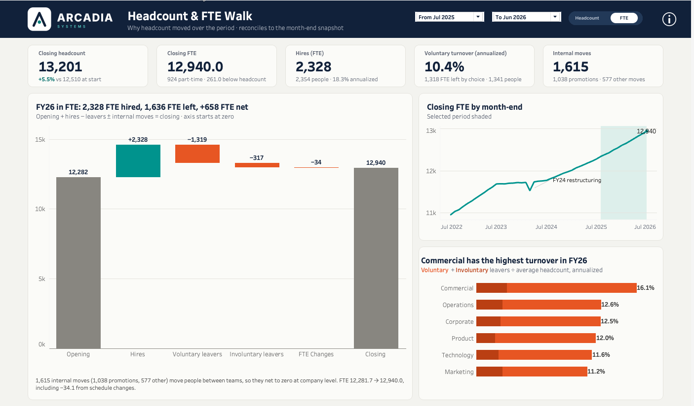

# Executive Summary: build book

**Headcount & FTE Walk · Arcadia Systems** · [Open on Tableau Public](https://public.tableau.com/app/profile/thialp/viz/arcadia_headcount_fte_walk/ExecutiveSummary)



This is the as-built record of the Executive Summary dashboard: the data, every worksheet, calculated field, parameter, color, font, position and tooltip, the decisions behind them, and the problems hit on the way. It is written so the dashboard can be rebuilt from scratch and so the next dashboard can reuse the same system.

Tableau Desktop 2026.2, published through Tableau Public. Arcadia Systems is a fictional company and all data is synthetic.

## Contents

1. [What the dashboard answers](#1-what-the-dashboard-answers)
2. [Data](#2-data)
3. [Design system](#3-design-system)
4. [Dashboard layout](#4-dashboard-layout)
5. [Parameters](#5-parameters)
6. [Calculated fields](#6-calculated-fields)
7. [Worksheets](#7-worksheets)
8. [Header, toggle and info panel](#8-header-toggle-and-info-panel)
9. [Behavior rules](#9-behavior-rules)
10. [Expected values](#10-expected-values)
11. [Publishing to Tableau Public](#11-publishing-to-tableau-public)
12. [Decision log](#12-decision-log)
13. [Tableau problems and fixes](#13-tableau-problems-and-fixes)
14. [Reusable patterns for the next dashboard](#14-reusable-patterns-for-the-next-dashboard)
15. [Known limits and backlog](#15-known-limits-and-backlog)
16. [Related files](#16-related-files)

---

## 1. What the dashboard answers

**Reader:** CHRO, CFO, HR leadership. **Question:** how much did the workforce change over a period, and from what?

| Area | Shows | Answers |
|---|---|---|
| Header | Title, From / To months, Headcount \| FTE toggle, info button | Which period and which unit am I looking at? |
| KPI band (5 cards) | Closing headcount, Closing FTE, Hires, Voluntary turnover, Internal moves | The five numbers a leader asks first |
| Waterfall (left) | Opening + hires − voluntary − involuntary (± FTE changes) = closing | Why the number moved, reconciled exactly |
| Trend (top right) | Closing headcount or FTE for all 48 month-ends, selected period shaded | Is this period normal against history? |
| Turnover by function (bottom right) | Voluntary + involuntary annualized turnover by function | Where are people leaving? |

The rule behind every element: **every number on the page reconciles to the month-end snapshot, and two numbers that sit next to each other are always in the same unit or say which unit they use.**

## 2. Data

### 2.1 Files and relationships

Six CSVs from [`data/marts/`](../data/marts/), connected in Tableau with **relationships** (not joins) from the fact table to each dimension:

| File | Rows | Related on |
|---|---:|---|
| `mart_headcount_fte_walk.csv` (fact) | 292,696 | — |
| `mart_dim_month.csv` | 48 | `month_end_date` |
| `mart_dim_department.csv` | 32 | `department_id` |
| `mart_dim_country.csv` | 15 | `country_code` |
| `mart_dim_job_family.csv` | 14 | `job_family_code` |
| `mart_dim_grade.csv` | 9 | `grade` |

Types to set on the Data Source tab: `month_end_date` Date, `grade` String (in both files), `fiscal_year` String, `headcount` whole number, `fte` decimal, `part_time_headcount` whole number (Sum).

### 2.2 The fact table grain

One row per month-end × department × country × job family × grade × movement category × movement reason, with `headcount`, `fte` and `part_time_headcount`.

| `movement_order` | `movement_category` | Sign |
|---:|---|---|
| 1 | Opening | + (level at the prior month-end) |
| 2 | Hires | + |
| 3 | Voluntary Terminations | − |
| 4 | Involuntary Terminations | − |
| 5 | Internal Moves Out | − |
| 6 | Internal Moves In | + |
| 7 | FTE Changes | ± (FTE only; headcount is 0) |
| 8 | Closing | + (level at the month-end) |

For every slice and month, Opening + movements = Closing, and each month's Closing equals the next month's Opening. Both are enforced by the SQL tests (14 and the walk tests), which is what lets Tableau sum movements across any range of months.

### 2.3 Part-time column (added for this dashboard)

`part_time_headcount` counts workers under 1.0 FTE. It is filled on **Opening and Closing rows only**; movement rows carry 0, because a move or an FTE change can flip a worker between full- and part-time, so a signed movement count would mean nothing on its own.

- SQL: [`sql/03_marts/mart_headcount_fte_walk.sql`](../sql/03_marts/mart_headcount_fte_walk.sql): `CASE WHEN prior_fte < 1 THEN 1 ELSE 0 END` on opening lines, `CASE WHEN current_fte < 1 THEN 1 ELSE 0 END` on closing lines.
- Test: [`tests/test_23_part_time_ties_to_worker_master.sql`](../tests/test_23_part_time_ties_to_worker_master.sql) recounts part-time workers from `int_worker_movement` for every month and checks that each month's opening equals the prior month's closing.
- FY26: 807 part-time at the opening (Jun 2025), 924 at the closing (Jun 2026).

## 3. Design system

### 3.1 Colors

| Role | Hex | Used for |
|---|---|---|
| Navy | `#13233A` | Header band, titles, values, labels |
| Capsule navy | `#243A57` | Headcount \| FTE toggle background |
| Header mist | `#C9D1DC` | Subtitle on the header band |
| Teal | `#00938D` | Increase bars (hires), trend line |
| Dark teal | `#006B66` | Positive note on card 1 (+5.5%) |
| Band tint | `#DDEFEB` | Selected-period band on the trend |
| Coral | `#E4572E` | Decrease bars (leavers), voluntary turnover |
| Dark coral | `#B8401F` | Involuntary turnover, negative note on card 1 |
| Warm gray | `#8C8A84` | Opening and Closing bars, zero line |
| Slate | `#5A6170` | Secondary text: subtitles, notes, axis labels |
| Grid | `#E4E3DD` | Card borders, gridlines |
| Card | `#FBFBF8` | Card and sheet backgrounds |
| Page | `#F3F3EF` | Dashboard background |
| White | `#FFFFFF` | Header title, dropdown boxes |

Palettes are installed from [`brand/Preferences.tps`](brand/Preferences.tps) (see [`brand/README.md`](brand/README.md)).

### 3.2 Type

Only Tableau's own fonts, because Tableau Public embeds no others.

| Element | Font |
|---|---|
| Dashboard title | Tableau Bold 18 pt, white |
| Dashboard subtitle | Tableau Book 9 pt, `#C9D1DC` |
| Chart title (line 1) | Tableau Bold 12 pt, navy |
| Chart subtitle (line 2) | Tableau Book 9 pt, slate |
| KPI title / value / note | Tableau Semibold 8 pt slate / Tableau Bold 20 pt navy / Tableau Book 8 pt slate |
| Bar and point labels | Tableau Semibold 9 pt, navy |
| Axis labels | Tableau Book 8 pt, slate |
| Dropdown text | Tableau Semibold 9 pt, navy |
| Tooltip | Semibold 12 (name), Semibold 16 (value), Book 9 slate (context) |

### 3.3 Shape, radius and assets

- **Corner radius** (Tableau 2026.2, Layout pane → Corner Radius): chart cards and the info panel **10**, toggle capsule **16**, dropdowns and the header band **0**. 10 matches the KPI card background image.
- Card treatment: background `#FBFBF8`, border 1 px `#E4E3DD`, inner padding 12.
- Logo: [`brand/arcadia_logo_horizontal_reverse.png`](brand/arcadia_logo_horizontal_reverse.png) on the navy band.
- KPI card background: [`brand/arcadia_kpi_cards_bg.png`](brand/arcadia_kpi_cards_bg.png) (transparent 1400 × 110, drawn at 2×).
- Custom shapes: [`brand/shapes/Arcadia/`](brand/shapes/Arcadia/) (`seg_headcount_on/off`, `seg_fte_on/off`, `info_open`, `info_close`), drawn by [`brand/build/make_toggle_shapes.py`](brand/build/make_toggle_shapes.py). Install by copying the folder to `Documents/My Tableau Repository/Shapes/` and choosing **Reload Shapes**; Tableau saves them inside the workbook, so viewers see them.

## 4. Dashboard layout

Fixed size **1400 × 850**, background `#F3F3EF`, every object **floating**, 56 px side gutter, right edge at 1344.

| # | Object | Type | x | y | w | h | Settings |
|---|---|---|---:|---:|---:|---:|---|
| 1 | Header band | Blank | 0 | 0 | 1400 | 76 | `#13233A`, radius 0 |
| 2 | Logo | Image | 56 | 14 | 177 | 48 | Reverse logo, Fit image on |
| 3 | Title + subtitle | Text | 256 | 10 | 560 | 58 | See 8.1 |
| 4 | Start Month | Parameter | 840 | 22 | 146 | 32 | White, radius 0, no title |
| 5 | End Month | Parameter | 996 | 22 | 146 | 32 | Same |
| 6 | Measure Toggle | Sheet | 1152 | 22 | 150 | 32 | `#243A57`, radius 16 |
| 7 | Info button | Show/Hide button | 1312 | 22 | 32 | 32 | Image button, see 8.3 |
| 8 | KPI card background | Image | 0 | 78 | 1400 | 110 | Fit image on, Center off |
| 9 | KPI cards | Sheet | 0 | 78 | 1400 | 110 | Background none, above the image |
| 10 | Waterfall | Sheet | 56 | 188 | 780 | 624 | Card; inner padding 12, **bottom 64** |
| 11 | Waterfall Caption | Sheet | 68 | 756 | 756 | 48 | Over the waterfall's bottom padding |
| 12 | Trend | Sheet | 848 | 188 | 496 | 300 | Card, radius 10 |
| 13 | Turnover by Function | Sheet | 848 | 500 | 496 | 312 | Card, radius 10 |
| 14 | Info Panel | Vertical container | 1004 | 84 | 340 | 340 | Card, radius 10, inner padding 16, hidden by default |

Widths add up: 780 + 12 + 496 = 1288 (= 1400 − 2 × 56); heights 300 + 12 + 312 = 624.

## 5. Parameters

| Parameter | Type | Values | Default | Display |
|---|---|---|---|---|
| **Start Month** | Date | List, from `month_end_date` | 2025-07-31 | Custom format `"From "mmm yyyy` |
| **End Month** | Date | List, from `month_end_date` | 2026-06-30 | Custom format `"To "mmm yyyy` |
| **Measure** | String | `Headcount`, `FTE` | Headcount | Set by the toggle (8.2) |

Plus 16 layout parameters for the KPI cards, all prefixed `kpi_` and never shown: `kpi_Scale` 0.010986328125, `kpi_SheetW` 1400, `kpi_SheetH` 110, `kpi_FitX` 1.1, `kpi_FitY` 1.1, `kpi_ShiftX` 0, `kpi_ShiftY` 0, `kpi_GridLeft` 56, `kpi_GridTop` 12, `kpi_CardW` 244, `kpi_CardH` 86, `kpi_GapX` 17, `kpi_PadX` 16, `kpi_TitleDY` 17, `kpi_ValueDY` 44, `kpi_SubDY` 71.

Removed during the build: `Show Methodology` (replaced by the info panel) and the trial `From (pick)` / `To (pick)` pair (see the decision log).

## 6. Calculated fields

Final versions only. Field names in brackets must match exactly.

### 6.1 Core

```
// Selected Value
IF [Measure] = "Headcount" THEN [Headcount] ELSE [Fte] END
```
```
// In Range
[Month End Date] >= [Start Month] AND [Month End Date] <= [End Month]
```
```
// Walk Value
// Opening from the first month, Closing from the last, movements summed across the range.
// Valid because each month's Closing equals the next month's Opening (SQL test 14).
IF [In Range] THEN
    CASE [Movement Category]
        WHEN "Opening" THEN IIF([Month End Date] = [Start Month], [Selected Value], 0)
        WHEN "Closing" THEN IIF([Month End Date] = [End Month],   [Selected Value], 0)
        ELSE [Selected Value]
    END
END
```
Default number format of `Walk Value`: Custom `#,##0;−#,##0`.

### 6.2 Measures

```
// Months in Range
COUNTD(IF [In Range] THEN [Month End Date] END)
```
```
// Average Headcount   (each month's (opening + closing) / 2, averaged across the range)
SUM(IF [In Range] AND ([Movement Category] = "Opening" OR [Movement Category] = "Closing")
    THEN [Headcount] END) / 2 / [Months in Range]
```
```
// Hires
SUM(IF [In Range] AND [Movement Category] = "Hires" THEN [Headcount] END)
```
```
// Voluntary Leavers
-SUM(IF [In Range] AND [Movement Category] = "Voluntary Terminations" THEN [Headcount] END)
```
```
// Involuntary Leavers
-SUM(IF [In Range] AND [Movement Category] = "Involuntary Terminations" THEN [Headcount] END)
```
```
// Internal Moves
SUM(IF [In Range] AND [Movement Category] = "Internal Moves In" THEN [Headcount] END)
```
```
// Voluntary Turnover (annualized)
ZN([Voluntary Leavers]) / [Average Headcount] * 12 / [Months in Range]
```
```
// Involuntary Turnover (annualized)
ZN([Involuntary Leavers]) / [Average Headcount] * 12 / [Months in Range]
```
```
// Hire Rate (annualized)
ZN([Hires]) / [Average Headcount] * 12 / [Months in Range]
```
Rates are formatted Percentage, 1 decimal. Turnover is always headcount-based, whatever the toggle says.

### 6.3 KPI card numbers (prefix `K`)

```
// K Valid
[Start Month] <= [End Month]
```
```
// K Open HC
ZN(SUM(IF [In Range] AND [Movement Category] = "Opening" AND [Month End Date] = [Start Month] THEN [Headcount] END))
```
```
// K Close HC
ZN(SUM(IF [In Range] AND [Movement Category] = "Closing" AND [Month End Date] = [End Month] THEN [Headcount] END))
```
```
// K Close FTE
ZN(SUM(IF [In Range] AND [Movement Category] = "Closing" AND [Month End Date] = [End Month] THEN [Fte] END))
```
```
// K Close PT
ZN(SUM(IF [In Range] AND [Movement Category] = "Closing" AND [Month End Date] = [End Month] THEN [Part Time Headcount] END))
```
```
// K Net Pct
IF [K Open HC] = 0 THEN 0 ELSE ([K Close HC] - [K Open HC]) / [K Open HC] END
```
```
// K Hires                    ZN([Hires])
// K Leavers Vol              ZN([Voluntary Leavers])
// K Moves                    ZN([Internal Moves])
// K Other Moves              [K Moves] - [K Promotions]
// K Part Time Gap            [K Close HC] - [K Close FTE]
```
```
// K Promotions
ZN(SUM(IF [In Range] AND [Movement Category] = "Internal Moves In" AND [Movement Reason] = "Promotion" THEN [Headcount] END))
```
```
// K Hires FTE
ZN(SUM(IF [In Range] AND [Movement Category] = "Hires" THEN [Fte] END))
```
```
// K Leavers Vol FTE
ZN(-SUM(IF [In Range] AND [Movement Category] = "Voluntary Terminations" THEN [Fte] END))
```
```
// K Hires Show   (the number card 3 headlines, in the selected unit)
IF [Measure] = "Headcount" THEN [K Hires] ELSE ROUND([K Hires FTE], 0) END
```
```
// K FTE T   (FTE in tenths: 12,940.0 -> 129400, to print one decimal with integer math)
INT(ROUND([K Close FTE] * 10, 0))
```
```
// K Gap T   (the part-time gap in tenths)
INT(ROUND([K Part Time Gap] * 10, 0))
```

### 6.4 Number-to-text patterns

Tableau has no format function for strings, so text is built with integer math. `DIV` is integer division, `%` the remainder. **Every branch must be wrapped in `STR(...)`**; a branch that returns a number breaks any field that adds it to a string.

**Comma pattern** (counts; 12510 → "12,510"):
```
IF [X] >= 1000
THEN STR(DIV(INT([X]), 1000)) + "," + RIGHT("00" + STR(INT([X]) % 1000), 3)
ELSE STR(INT([X])) END
```
**Percent pattern** (0.055 → "5.5"):
```
STR(DIV(INT(ROUND(ABS([R]) * 1000, 0)), 10)) + "." + STR(INT(ROUND(ABS([R]) * 1000, 0)) % 10)
```
**Tenths pattern** (one decimal; T = value × 10 as an integer, 129400 → "12,940.0"):
```
IF [T] >= 10000
THEN STR(DIV([T], 10000)) + "," + RIGHT("00" + STR(DIV([T], 10) % 1000), 3)
ELSE STR(DIV([T], 10)) END
+ "." + STR([T] % 10)
```

Text helpers built from these:

| Field | Pattern | On |
|---|---|---|
| `K Open Str` | comma | `[K Open HC]` |
| `K Net Pct Str` | percent + `"%"` | `[K Net Pct]` |
| `K Hires HC Str` | comma | `[K Hires]` |
| `K Hires FTE Str` | comma | `ROUND([K Hires FTE], 0)` |
| `K Vol HC Str` | comma | `[K Leavers Vol]` |
| `K Vol FTE Str` | comma | `ROUND([K Leavers Vol FTE], 0)` |
| `K Hire Rate Str` | percent on `ZN([Hire Rate (annualized)])` + `"%"` | |

### 6.5 KPI card text

| Card | Title field | Value field | Note field(s) |
|---|---|---|---|
| 1 | `KPI 1 Title` = `"Closing headcount"` | `KPI 1 Value` | `KPI 1 Note Up`, `Note Down`, `Note Flat`, `Note Rest` |
| 2 | `KPI 2 Title` = `"Closing FTE"` | `KPI 2 Value` | `KPI 2 Note` |
| 3 | `KPI 3 Title` (follows the toggle) | `KPI 3 Value` | `KPI 3 Note` |
| 4 | `KPI 4 Title` = `"Voluntary turnover (annualized)"` | `KPI 4 Value` | `KPI 4 Note` |
| 5 | `KPI 5 Title` = `"Internal moves"` | `KPI 5 Value` | `KPI 5 Note` |

```
// KPI 1 Value
IF NOT [K Valid] THEN "—"
ELSEIF [K Close HC] >= 1000
THEN STR(DIV(INT([K Close HC]), 1000)) + "," + RIGHT("00" + STR(INT([K Close HC]) % 1000), 3)
ELSE STR(INT([K Close HC])) END
```
```
// KPI 1 Note Up     IF [K Valid] AND [K Net Pct] > 0 THEN "+" + [K Net Pct Str] END     (dark teal #006B66, Semibold)
// KPI 1 Note Down   IF [K Valid] AND [K Net Pct] < 0 THEN "−" + [K Net Pct Str] END     (dark coral #B8401F, Semibold)
// KPI 1 Note Flat   IF [K Valid] AND [K Net Pct] = 0 THEN [K Net Pct Str] END           (slate, Semibold)
// KPI 1 Note Rest   IF [K Valid] THEN "vs " + [K Open Str] + " at start" END            (slate, Book)
```
All four sit on one label: `<KPI 1 Note Up><KPI 1 Note Down><KPI 1 Note Flat> <KPI 1 Note Rest>`. Only one of the first three is ever non-empty, so the color follows the sign.

```
// KPI 2 Value   (one decimal: the decimal is what shows part-time schedules)
IF NOT [K Valid] THEN "—" ELSE
  IF [K FTE T] >= 10000
  THEN STR(DIV([K FTE T], 10000)) + "," + RIGHT("00" + STR(DIV([K FTE T], 10) % 1000), 3)
  ELSE STR(DIV([K FTE T], 10)) END
  + "." + STR([K FTE T] % 10)
END
```
```
// KPI 2 Note   ("924 part-time · 261.0 below headcount")
IF NOT [K Valid] THEN "" ELSE
  IF [K Close PT] >= 1000
  THEN STR(DIV(INT([K Close PT]), 1000)) + "," + RIGHT("00" + STR(INT([K Close PT]) % 1000), 3)
  ELSE STR(INT([K Close PT])) END
  + " part-time · " + STR(DIV([K Gap T], 10)) + "." + STR([K Gap T] % 10) + " below headcount"
END
```
```
// KPI 3 Title
IF [Measure] = "Headcount" THEN "Hires" ELSE "Hires (FTE)" END
```
```
// KPI 3 Value
IF NOT [K Valid] THEN "—"
ELSEIF [K Hires Show] >= 1000
THEN STR(DIV(INT([K Hires Show]), 1000)) + "," + RIGHT("00" + STR(INT([K Hires Show]) % 1000), 3)
ELSE STR(INT([K Hires Show])) END
```
```
// KPI 3 Note
IF NOT [K Valid] THEN ""
ELSEIF [Measure] = "Headcount"
THEN [K Hire Rate Str] + " annualized · " + [K Hires FTE Str] + " FTE"
ELSE [K Hires HC Str] + " people · " + [K Hire Rate Str] + " annualized"
END
```
```
// KPI 4 Value   (hidden for groups under 20 people)
IF NOT [K Valid] OR [Average Headcount] < 20 THEN "—" ELSE
  STR(DIV(INT(ROUND([Voluntary Turnover (annualized)] * 1000, 0)), 10)) + "." +
  STR(INT(ROUND([Voluntary Turnover (annualized)] * 1000, 0)) % 10) + "%"
END
```
```
// KPI 4 Note   (the rate is always headcount-based; the note shows both units)
IF NOT [K Valid] THEN ""
ELSEIF [Measure] = "Headcount"
THEN [K Vol HC Str] + " left by choice · " + [K Vol FTE Str] + " FTE"
ELSE [K Vol FTE Str] + " FTE left by choice · " + [K Vol HC Str] + " people"
END
```
```
// KPI 5 Value   (comma pattern on [K Moves], "—" when not K Valid)
// KPI 5 Note
IF NOT [K Valid] THEN "" ELSE
  IF [K Promotions] >= 1000
  THEN STR(DIV(INT([K Promotions]), 1000)) + "," + RIGHT("00" + STR(INT([K Promotions]) % 1000), 3)
  ELSE STR(INT([K Promotions])) END
  + " promotions · " +
  IF [K Other Moves] >= 1000
  THEN STR(DIV(INT([K Other Moves]), 1000)) + "," + RIGHT("00" + STR(INT([K Other Moves]) % 1000), 3)
  ELSE STR(INT([K Other Moves])) END
  + " other moves"
END
```

### 6.6 KPI card geometry (text drawn as map layers)

Pixel (x, y) on the 1400 × 110 sheet → (lat, lon), origin at the sheet center: `lon = (x − W/2) × scale × FitX`, `lat = −(y − H/2) × scale × FitY`. `MAKEPOINT` takes **(latitude, longitude)**.

```
// kpi_lat Title   -([kpi_GridTop] + [kpi_TitleDY] + [kpi_ShiftY] - [kpi_SheetH] / 2) * [kpi_Scale] * [kpi_FitY]
// kpi_lat Value   -([kpi_GridTop] + [kpi_ValueDY] + [kpi_ShiftY] - [kpi_SheetH] / 2) * [kpi_Scale] * [kpi_FitY]
// kpi_lat Sub     -([kpi_GridTop] + [kpi_SubDY]   + [kpi_ShiftY] - [kpi_SheetH] / 2) * [kpi_Scale] * [kpi_FitY]
```
```
// kpi_lon C1 … C5   (i = 0 … 4, written out in each field)
([kpi_GridLeft] + i * ([kpi_CardW] + [kpi_GapX]) + [kpi_PadX] + [kpi_ShiftX] - [kpi_SheetW] / 2) * [kpi_Scale] * [kpi_FitX]
```
```
// kpi_pt Title n   MAKEPOINT([kpi_lat Title], [kpi_lon Cn])     (and kpi_pt Value n, kpi_pt Note n with kpi_lat Value / kpi_lat Sub)
// kpi_Corner TL    MAKEPOINT([kpi_SheetH] / 2 * [kpi_Scale], -[kpi_SheetW] / 2 * [kpi_Scale])
// kpi_Corner BR    MAKEPOINT(-[kpi_SheetH] / 2 * [kpi_Scale], [kpi_SheetW] / 2 * [kpi_Scale])
```
15 text anchors (5 cards × title, value, note) plus 2 invisible corners that pin the map's extent. Full method: [`tableau_kpi_cards_guide.md`](tableau_kpi_cards_guide.md).

### 6.7 Waterfall

```
// Waterfall Position   (table calc: Compute Using Movement Category, sorted by Movement Order)
IF ATTR([Movement Category]) = "Closing" THEN SUM([Walk Value]) ELSE RUNNING_SUM(SUM([Walk Value])) END
```
```
// Waterfall Size   (negative on purpose: the Gantt bar is drawn back from the running total)
-SUM([Walk Value])
```
```
// Bar Type   (an aggregate, so it can go on Color without restarting the running sum)
IF ATTR([Movement Category]) = "Opening" OR ATTR([Movement Category]) = "Closing" THEN "Level"
ELSEIF SUM([Walk Value]) >= 0 THEN "Increase"
ELSE "Decrease"
END
```
```
// Show Category   (filter, keep True: the FTE Changes bar only exists in FTE mode)
[Measure] = "FTE" OR [Movement Category] <> "FTE Changes"
```
```
// Move Label    IF ATTR([Movement Category]) <> "Opening" AND ATTR([Movement Category]) <> "Closing" THEN SUM([Walk Value]) END
//               number format +#,##0;−#,##0;0
// Level Label   IF ATTR([Movement Category]) = "Opening" OR ATTR([Movement Category]) = "Closing" THEN SUM([Walk Value]) END
//               number format #,##0
```

### 6.8 Waterfall title and caption

The waterfall's marks are split by Movement Category, so company-level numbers in the title must be **FIXED** (a plain SUM would only see one bar's rows).

```
// WF Open        ZN({ FIXED : SUM(IF [In Range] AND [Movement Category] = "Opening" AND [Month End Date] = [Start Month] THEN [Headcount] END) })
// WF Close       ZN({ FIXED : SUM(IF [In Range] AND [Movement Category] = "Closing" AND [Month End Date] = [End Month] THEN [Headcount] END) })
// WF Hires       ZN({ FIXED : SUM(IF [In Range] AND [Movement Category] = "Hires" THEN [Headcount] END) })
// WF Leavers     ZN({ FIXED : -SUM(IF [In Range] AND ([Movement Category] = "Voluntary Terminations" OR [Movement Category] = "Involuntary Terminations") THEN [Headcount] END) })
// WF Moves       ZN({ FIXED : SUM(IF [In Range] AND [Movement Category] = "Internal Moves In" THEN [Headcount] END) })
// WF Promos      ZN({ FIXED : SUM(IF [In Range] AND [Movement Category] = "Internal Moves In" AND [Movement Reason] = "Promotion" THEN [Headcount] END) })
// WF FTE Open    ZN({ FIXED : SUM(IF [In Range] AND [Movement Category] = "Opening" AND [Month End Date] = [Start Month] THEN [Fte] END) })
// WF FTE Close   ZN({ FIXED : SUM(IF [In Range] AND [Movement Category] = "Closing" AND [Month End Date] = [End Month] THEN [Fte] END) })
// WF FTE Chg     ZN({ FIXED : SUM(IF [In Range] AND [Movement Category] = "FTE Changes" THEN [Fte] END) })
// WF FTE Hires   ZN({ FIXED : SUM(IF [In Range] AND [Movement Category] = "Hires" THEN [Fte] END) })
// WF FTE Leavers ZN({ FIXED : -SUM(IF [In Range] AND ([Movement Category] = "Voluntary Terminations" OR [Movement Category] = "Involuntary Terminations") THEN [Fte] END) })
```

Text helpers, all with the comma pattern and **whole numbers** (everything on the waterfall card is a whole number, so it ties at a glance):

| Field | On |
|---|---|
| `WF Hires Str` | `[WF Hires]` |
| `WF Leavers Str` | `[WF Leavers]` |
| `WF Net Str` | `ABS([WF Close] - [WF Open])` |
| `WF Moves Str` | `[WF Moves]` |
| `WF Promos Str` | `[WF Promos]` |
| `WF Other Str` | `[WF Moves] - [WF Promos]` |
| `WF FTE Open Str` | `INT(ROUND([WF FTE Open], 0))` |
| `WF FTE Close Str` | `INT(ROUND([WF FTE Close], 0))` |
| `WF FTE Hires Str` | `INT(ROUND([WF FTE Hires], 0))` |
| `WF FTE Leavers Str` | `INT(ROUND([WF FTE Leavers], 0))` |

```
// WF FTE Chg Str   (signed)
IF [WF FTE Chg] < 0 THEN "−" ELSE "+" END + STR(INT(ROUND(ABS([WF FTE Chg]), 0)))
```
```
// WF FTE Net Str   (signed)
IF ROUND([WF FTE Close] - [WF FTE Open], 0) < 0 THEN "−" ELSE "+" END +
STR(INT(ABS(ROUND([WF FTE Close] - [WF FTE Open], 0))))
```
```
// WF Period   (one month reads "Jul 2025"; twelve months read as the fiscal year, which starts July 1)
IF [Start Month] = [End Month]
THEN LEFT(DATENAME('month', [Start Month]), 3) + " " + STR(YEAR([Start Month]))
ELSEIF DATEDIFF('month', [Start Month], [End Month]) = 11
THEN "FY" + RIGHT(STR(YEAR([End Month]) + IF MONTH([End Month]) >= 7 THEN 1 ELSE 0 END), 2)
ELSE LEFT(DATENAME('month', [Start Month]), 3) + " " + STR(YEAR([Start Month])) + " – " +
     LEFT(DATENAME('month', [End Month]), 3) + " " + STR(YEAR([End Month]))
END
```
```
// WF Title
IF NOT [K Valid] THEN "Choose a start month on or before the end month"
ELSEIF [Measure] = "Headcount" THEN
     [WF Period] + ": " + [WF Hires Str] + " hires " +
     IF [WF Hires] >= [WF Leavers] THEN "outpaced " ELSE "fell short of " END +
     [WF Leavers Str] + " leavers, " +
     IF [WF Close] >= [WF Open] THEN "adding " ELSE "removing " END +
     [WF Net Str] + " people"
ELSE [WF Period] + " in FTE: " + [WF FTE Hires Str] + " FTE hired, " + [WF FTE Leavers Str] +
     " FTE left, " + [WF FTE Net Str] + " FTE net"
END
```
```
// WF Caption
IF NOT [K Valid] THEN "" ELSE
[WF Moves Str] + " internal moves (" + [WF Promos Str] + " promotions, " + [WF Other Str] +
" other) move people between teams, so they net to zero at company level. FTE " +
[WF FTE Open Str] + " → " + [WF FTE Close Str] + ", including " + [WF FTE Chg Str] + " from schedule changes."
END
```

### 6.9 Waterfall tooltip

```
// TT Unit         IF [Measure] = "Headcount" THEN "workers" ELSE "FTE" END
// TT Noun         IF [Measure] = "Headcount" THEN "headcount" ELSE "FTE" END
// TT Open Ref     IF [Measure] = "Headcount" THEN [WF Open] ELSE [WF FTE Open] END
// TT Close Ref    IF [Measure] = "Headcount" THEN [WF Close] ELSE [WF FTE Close] END
// TT Months       { FIXED : COUNTD(IF [In Range] THEN [Month End Date] END) }
// TT Open Month   LEFT(DATENAME('month', DATEADD('month', -1, [Start Month])), 3) + " " + STR(YEAR(DATEADD('month', -1, [Start Month])))
// TT Close Month  LEFT(DATENAME('month', [End Month]), 3) + " " + STR(YEAR([End Month]))
```
```
// TT Share Str   (MAX() turns the FIXED value into an aggregate so it can sit beside SUM)
IF MAX([TT Open Ref]) = 0 THEN "" ELSE
  STR(DIV(INT(ROUND(ABS(SUM([Walk Value])) / MAX([TT Open Ref]) * 1000, 0)), 10)) + "." +
  STR(INT(ROUND(ABS(SUM([Walk Value])) / MAX([TT Open Ref]) * 1000, 0)) % 10) + "%"
END
```
```
// TT Net Str
IF MAX([TT Open Ref]) = 0 THEN "" ELSE
  IF MAX([TT Close Ref]) >= MAX([TT Open Ref]) THEN "+" ELSE "−" END +
  STR(DIV(INT(ROUND(ABS(MAX([TT Close Ref]) - MAX([TT Open Ref])) / MAX([TT Open Ref]) * 1000, 0)), 10)) + "." +
  STR(INT(ROUND(ABS(MAX([TT Close Ref]) - MAX([TT Open Ref])) / MAX([TT Open Ref]) * 1000, 0)) % 10) + "%"
END
```
```
// TT Context
CASE ATTR([Movement Category])
WHEN "Opening" THEN "Active at the end of " + [TT Open Month]
WHEN "Closing" THEN "Active at the end of " + [TT Close Month] + " · " + [TT Net Str] + " vs opening"
WHEN "FTE Changes" THEN "Schedule changes for workers who stayed. Headcount does not move."
ELSE [TT Share Str] + " of opening " + [TT Noun] + " · about " +
     STR(INT(ROUND(ABS(SUM([Walk Value])) / MAX([TT Months]), 0))) + " per month"
END
```
```
// TT Level HC / TT Level FTE / TT Level PT   (the bar's own level rows; PT wrapped in ZN)
SUM(IF [In Range] AND (([Movement Category] = "Opening" AND [Month End Date] = [Start Month])
                    OR ([Movement Category] = "Closing" AND [Month End Date] = [End Month]))
    THEN [Headcount] END)          -- [Fte] for TT Level FTE, [Part Time Headcount] for TT Level PT
```
```
// TT Bar T    INT(ROUND(ABS(SUM(IF [In Range] THEN [Fte] END)) * 10, 0))     (this bar's FTE in tenths)
// TT Bar HC   ABS(SUM(IF [In Range] THEN [Headcount] END))
```
```
// TT Part Time   (levels: part-time count and FTE gap; movement bars: people-to-FTE bridge)
IF ATTR([Movement Category]) = "Opening" OR ATTR([Movement Category]) = "Closing" THEN
  IF [TT Level HC] = 0 THEN "" ELSE
    (IF [TT Level PT] >= 1000
     THEN STR(DIV(INT([TT Level PT]), 1000)) + "," + RIGHT("00" + STR(INT([TT Level PT]) % 1000), 3)
     ELSE STR(INT([TT Level PT])) END)
    + " part-time (" +
    STR(DIV(INT(ROUND([TT Level PT] / [TT Level HC] * 1000, 0)), 10)) + "." +
    STR(INT(ROUND([TT Level PT] / [TT Level HC] * 1000, 0)) % 10) + "%) · FTE is " +
    STR(DIV(INT(ROUND(([TT Level HC] - [TT Level FTE]) * 10, 0)), 10)) + "." +
    STR(INT(ROUND(([TT Level HC] - [TT Level FTE]) * 10, 0)) % 10) + " below headcount"
  END
ELSEIF [TT Bar HC] = 0 THEN ""
ELSE
  (IF [TT Bar HC] >= 1000
   THEN STR(DIV(INT([TT Bar HC]), 1000)) + "," + RIGHT("00" + STR(INT([TT Bar HC]) % 1000), 3)
   ELSE STR(INT([TT Bar HC])) END)
  + " people = " +
  (IF [TT Bar T] >= 10000
   THEN STR(DIV([TT Bar T], 10000)) + "," + RIGHT("00" + STR(DIV([TT Bar T], 10) % 1000), 3)
   ELSE STR(DIV([TT Bar T], 10)) END)
  + "." + STR([TT Bar T] % 10) + " FTE (part-timers count as a fraction)"
END
```

### 6.10 Trend

```
// Band Start   (the month-end before the start month: the walk opens there)
DATEADD('day', -1, DATETRUNC('month', [Start Month]))
```
```
// Trend Title
IF [Measure] = "Headcount" THEN "Closing headcount by month-end" ELSE "Closing FTE by month-end" END
```

### 6.11 Turnover by function

```
// Vol Rate Shown     IF [Average Headcount] < 20 THEN NULL ELSE [Voluntary Turnover (annualized)] END
// Invol Rate Shown   IF [Average Headcount] < 20 THEN NULL ELSE [Involuntary Turnover (annualized)] END
// Total Rate Shown   IF [Average Headcount] < 20 THEN NULL ELSE [Voluntary Turnover (annualized)] + [Involuntary Turnover (annualized)] END
```
```
// Total Label Pos   (where the total label sits: just past the end of the bar)
[Total Rate Shown] + 0.009
```
```
// TO Top Function   (table calc, Compute Using Function Name: the first row of the sorted chart)
LOOKUP(ATTR([Function Name]), FIRST())
```
```
// TO Title
IF ISNULL([TO Top Function]) THEN "Turnover by function"
ELSE [TO Top Function] + " has the highest turnover in " + [WF Period] END
```

### 6.12 Toggle

```
// Measure Option   (two rows of the data give the two choices)
IF [Movement Category] = "Opening" THEN "Headcount"
ELSEIF [Movement Category] = "Closing" THEN "FTE"
END
```
```
// Option State    IF [Measure Option] = [Measure] THEN "On" ELSE "Off" END
// Toggle Shape    [Measure Option] + " " + [Option State]
```

## 7. Worksheets

| Sheet | Purpose | Visible on the dashboard |
|---|---|---|
| KPI cards | Five cards as map text layers | Yes |
| Waterfall | Main chart | Yes |
| Waterfall Caption | Text under the waterfall | Yes |
| Trend | Closing level over time | Yes |
| Turnover by Function | Turnover bars | Yes |
| Measure Toggle | Headcount \| FTE capsule | Yes |
| CheckList | Working sheet with the FY26 check values | No (hidden) |

All worksheet tabs are hidden before publishing (right-click → Hide Sheet), so only the dashboard shows.

### 7.1 KPI cards

- Map sheet. Layers: `kpi_Corner TL`, `kpi_Corner BR`, then 15 text layers (`kpi_pt Title 1…5`, `kpi_pt Value 1…5`, `kpi_pt Note 1…5`).
- Every layer: mark **Circle**, smallest size, **color opacity 0%**; nothing else on its Marks card except the label field (a dimension would split the mark and blank the label).
- Label pop-up: Show mark labels, Allow labels to overlap other marks, Alignment Horizontal **Right** (text starts at the anchor), Vertical Middle.
- Map → Background Maps None; Map Options: no search, no toolbar, no pan/zoom. Entire View; tooltips off; null indicator hidden.
- Size comes from the dashboard (1400 × 110 floating), never the sheet editor; judge positions on the dashboard.

### 7.2 Waterfall

- Columns `Movement Category`, sorted by `Movement Order` (Field, Minimum, ascending). Rows `Waterfall Position` (Compute Using Movement Category).
- Mark **Gantt Bar**; Size `Waterfall Size`; Color `Bar Type` (Level `#8C8A84`, Increase `#00938D`, Decrease `#E4572E`); legend removed from the dashboard.
- Filter `Show Category` = True.
- Label: `Move Label` and `Level Label` on Label, text `<Move Label><Level Label>`, Tableau Semibold 9 pt navy.
- Aliases: Voluntary Terminations → `Voluntary leavers`, Involuntary Terminations → `Involuntary leavers`.
- Axis: Include zero; Fixed major ticks every 5,000; format `#,##0,"k"` (0k, 5k, 10k, 15k); no axis title. Gridlines `#E4E3DD`, zero line `#8C8A84`, no axis rulers.
- Shading: Worksheet and Pane `#FBFBF8`; no row/column dividers.
- Title: `WF Title` on Detail, then Show Title with line 1 `<WF Title>` (Tableau Bold 12 navy) and line 2 `Opening + hires − leavers ± internal moves = closing · axis starts at zero` (Tableau Book 9 slate).
- Tooltip: `TT Unit`, `TT Context`, `TT Part Time` and `Walk Value` on Detail; Include command buttons off; text:

  ```
  <Movement Category>                      Tableau Semibold 12, navy
  <SUM(Walk Value)> <TT Unit>              Tableau Semibold 16, navy
  <AGG(TT Context)>                        Tableau Book 9, slate
  <AGG(TT Part Time)>                      Tableau Book 9, slate
  ```

### 7.3 Waterfall Caption

Text mark, `WF Caption` on Label (Tableau Book 8 pt slate, left, wrap on), headers and title hidden, Entire View, shading `#FBFBF8`. Floated over the waterfall's 64 px bottom padding.

### 7.4 Trend

- Filter `Movement Category` = Closing only; no date filter (all 48 months stay as context).
- Columns `Month End Date` (exact date, continuous); Rows `SUM(Selected Value)`.
- Mark **Line**, teal `#00938D`, 2 px. Label: Most Recent only, Tableau Semibold 9 pt navy, `#,##0`.
- Reference **band on the horizontal date axis** (the vertical axis only offers numbers): Per Pane, From `Band Start` (Minimum) To `End Month`, fill solid `#DDEFEB` (the band has no opacity setting; a teal band hides the teal line), no line, no label.
- Vertical axis: Include zero off, `#,##0,"k"`, no title. Horizontal: Fixed ticks yearly from 7/1/2022, format `mmm yy`, no title. Axis fonts Book 8 slate.
- Title: `Trend Title` on Detail; line 1 `<Trend Title>` (Bold 12 navy), line 2 `Selected period shaded` (Book 9 slate).
- Annotation: `FY24 restructuring` on the low point (Book 8 slate, no border).
- Tooltip: `<Month End Date>` (Semibold) and `<SUM(Selected Value)>`.

### 7.5 Turnover by Function

- Rows `Function Name`. Columns: `Vol Rate Shown` and `Invol Rate Shown` on **one axis** (Measure Values), plus `Total Label Pos` as a second pill, **Dual Axis**, **Synchronize Axis**, top axis header hidden.
- After building Measure Values, **remove the extra `Measure Names` pill Tableau puts on Rows**; it must stay only on Color. Otherwise each function splits into one row per measure.
- Filter `Measure Names` to the two rates; filter `Total Rate Shown` → Non-null (drops Executive, about 12 people).
- Sort `Function Name` by `Total Rate Shown`, descending.
- Measure Values layer: **Bar**, stacked (Analysis → Stack Marks automatic), Vol coral `#E4572E`, Invol dark coral `#B8401F`, size about two-thirds.
- `AGG(Total Label Pos)` layer: mark **Text** (it draws no bar), `Total Rate Shown` on Label (Semibold 9 navy), `Measure Names` off its Color. The label is centered on its point, so the point sits 0.009 past the bar end.
- Title: line 1 `<TO Title>` (Bold 12 navy). Line 2 (Book 9): `Voluntary` coral + ` + ` + `Involuntary` dark coral + ` leavers ÷ average headcount, annualized` slate. Tableau's default title (`<Measure Names>`) prints "All" and must be replaced.
- Hide both axes, no gridlines or dividers, function labels Book 9 navy, field header hidden, shading `#FBFBF8`.
- Tooltip: function, total rate, voluntary rate and leavers, involuntary rate and leavers, average headcount (counts formatted `#,##0`).

### 7.6 Measure Toggle

- Filter `Measure Option` excludes Null. Columns `Measure Option`, **manual sort**: Headcount, FTE.
- Mark **Shape**, `Toggle Shape` on Shape with the Arcadia palette: `Headcount On` → `seg_headcount_on`, `Headcount Off` → `seg_headcount_off`, `FTE On` → `seg_fte_on`, `FTE Off` → `seg_fte_off`. Size at maximum, Entire View, header hidden, tooltips off, shading `#243A57`.
- Dashboard action **Change Parameter**: source Measure Toggle, run on Select, target `Measure`, field `Measure Option`, clearing keeps the current value.
- Each cell is 75 × 32 and each image 300 × 128, so the aspect ratio matches.

## 8. Header, toggle and info panel

### 8.1 Title

Text object, line 1 `Headcount & FTE Walk` (Tableau Bold 18, white), line 2 `Why headcount moved over the period · reconciles to the month-end snapshot` (Tableau Book 9, `#C9D1DC`). Width 560 so the subtitle never cuts off.

### 8.2 Dropdowns and toggle

- Start / End Month: single-value dropdowns, control title off, white background, no border, radius 0, padding 0, Tableau Semibold 9 navy. The display formats print "From Jul 2025" and "To Jun 2026", so no title is needed.
- Inputs stay square, buttons are rounded: the capsule (radius 16) and the info icon read as buttons, the dropdowns as inputs.

### 8.3 Info button and panel

- Vertical container `Info Panel` (1004, 84, 340 × 340), card style, inner padding 16, with one Text object.
- Container menu → **Add Show/Hide Button**, floated at (1312, 22, 32 × 32). Edit Button: style Image, hidden state `info_open.png`, shown state `info_close.png`, tooltip `Definitions`, no background or border.
- Saved with the panel hidden so the dashboard opens clean.

Panel text (heading Tableau Semibold 10 navy; body Tableau Book 9 slate; lead-ins Semibold):

> **How to read this page**
>
> **Period.** The walk starts at the month-end before *From* and ends at the month-end of *To*. Choose *From* on or before *To*. Arcadia's fiscal year starts July 1.
>
> **Headcount.** Workers with an active record at month-end.
>
> **FTE.** Scheduled hours ÷ full-time hours. A part-time worker counts as a fraction, so FTE is lower than headcount; the Closing FTE card shows the gap and how many part-timers sit behind it.
>
> **The walk.** Opening + hires − leavers ± internal moves = closing. It reconciles exactly to the month-end snapshot, in headcount and in FTE.
>
> **Headcount | FTE toggle.** Switches the waterfall and the notes on the Hires and turnover cards. The two closing cards always show both measures. Turnover rates are always headcount-based.
>
> **Internal moves.** Promotions and transfers move people between teams, so they net to zero at company level.
>
> **Turnover.** Leavers ÷ average headcount, annualized. Groups under 20 people are not shown.
>
> **Data.** Arcadia Systems is a fictional company and all data is synthetic.

## 9. Behavior rules

| Element | Headcount mode | FTE mode |
|---|---|---|
| Card 1 Closing headcount | people | people (fixed) |
| Card 2 Closing FTE | FTE, one decimal | same (fixed) |
| Card 3 Hires | "Hires", people; note: rate · FTE | "Hires (FTE)", FTE; note: people · rate |
| Card 4 Voluntary turnover | rate (headcount-based); note: people · FTE | same rate; note: FTE · people |
| Card 5 Internal moves | people (fixed) | people (fixed) |
| Waterfall bars and title | people | FTE, whole numbers, plus the FTE Changes bar |
| Trend | closing headcount | closing FTE |
| Turnover chart | headcount-based (fixed) | same |

Period rules:

- **Same month** (From Jul 2025, To Jul 2025) is a valid one-month walk: opening is the prior month-end (Jun 2025, 12,510), closing is Jul 2025 (12,572); the title reads "Jul 2025: …".
- **Reversed** (From after To) cannot be prevented, because Tableau cannot limit one parameter's list by another. It is handled: cards show "—" and the waterfall title reads "Choose a start month on or before the end month".
- Turnover rates, card 4 and the turnover bars hide any group averaging under 20 people.

## 10. Expected values

### FY26 (From Jul 2025, To Jun 2026)

| Item | Headcount | FTE |
|---|---|---|
| Opening (Jun 2025) | 12,510 | 12,282 (12,281.7) |
| Hires | +2,354 | +2,328 (2,328.3) |
| Voluntary leavers | −1,341 | −1,319 (1,318.5) |
| Involuntary leavers | −322 | −317 (317.4) |
| FTE changes | — | −34 (34.1) |
| Closing (Jun 2026) | 13,201 | 12,940 (12,940.0) |
| Waterfall title | FY26: 2,354 hires outpaced 1,663 leavers, adding 691 people | FY26 in FTE: 2,328 FTE hired, 1,636 FTE left, +658 FTE net |

| Card | Value | Note (Headcount mode) |
|---|---|---|
| Closing headcount | 13,201 | +5.5% vs 12,510 at start |
| Closing FTE | 12,940.0 | 924 part-time · 261.0 below headcount |
| Hires | 2,354 | 18.3% annualized · 2,328 FTE |
| Voluntary turnover (annualized) | 10.4% | 1,341 left by choice · 1,319 FTE |
| Internal moves | 1,615 | 1,038 promotions · 577 other moves |

Caption: *1,615 internal moves (1,038 promotions, 577 other) move people between teams, so they net to zero at company level. FTE 12,282 → 12,940, including −34 from schedule changes.*

Turnover by function: Commercial 16.1% (13.0% voluntary + 3.1% involuntary; 399 and 95 leavers; average headcount 3,063), Operations 12.6%, Corporate 12.5%, Product 12.0%, Technology 11.6%, Marketing 11.2%; Executive hidden.

Waterfall tooltips (Headcount): Opening "Active at the end of Jun 2025" · "807 part-time (6.5%) · FTE is 228.3 below headcount"; Hires "18.8% of opening headcount · about 196 per month" · "2,354 people = 2,328.3 FTE"; Voluntary "10.7% … about 112 per month" · "1,341 people = 1,318.5 FTE"; Involuntary "2.6% … about 27 per month" · "322 people = 317.4 FTE"; Closing "Active at the end of Jun 2026 · +5.5% vs opening" · "924 part-time (7.0%) · FTE is 261.0 below headcount".

FTE ties exactly: 12,281.7 + 2,328.3 − 1,318.5 − 317.4 − 34.1 = 12,940.0.

### Short-range check (From Jul 2025, To Aug 2025)

| Item | Headcount | FTE |
|---|---|---|
| Hires | 381 | 376.9 |
| Voluntary leavers | 226 | 221.3 |
| Involuntary leavers | 44 | 43.4 |
| FTE changes | 0 | −5.4 |
| Opening → Closing | 12,510 → 12,621 | 12,281.7 → 12,388.5 |

## 11. Publishing to Tableau Public

1. Final checks: fixed 1400 × 850; worksheet tabs hidden; info panel closed; dashboard tab named **Executive Summary**; every control tested (both dropdowns, the toggle, the info button, the three tooltips).
2. If **Server → Tableau Public → Save to Tableau Public As…** is greyed out (the whole submenu, as on a license without Tableau Public enabled), save a **Tableau Packaged Workbook (.twbx)**, open it in the free **Tableau Public** desktop app (version 2026.2 or newer, to open a 2026.2 workbook), sign in and use **File → Save to Tableau Public As…**. The .twbx carries the CSVs, the images and the custom shapes; Tableau Public builds the extract (292,696 rows, far below the 15-million-row limit).
3. Title: `Headcount & FTE Walk · Arcadia Systems`. The description must be under 231 characters:

   > Why did headcount move? A reconciled workforce walk: hires, leavers and internal moves, in headcount or FTE. Arcadia Systems is a fictional company and all numbers are synthetic, not real data.

4. Published: <https://public.tableau.com/app/profile/thialp/viz/arcadia_headcount_fte_walk/ExecutiveSummary>

## 12. Decision log

| Decision | Why | Alternatives dropped |
|---|---|---|
| KPI cards as map text layers on one sheet | One query, positions driven by parameters, no stale images | Five text sheets (slow, hard to align) |
| Waterfall as a Gantt with aggregate Bar Type | A dimension on Color restarts RUNNING_SUM | Stacked bars; a dimension on Color |
| Waterfall axis starts at zero | Movement sizes are not exaggerated | Zoomed axis |
| Title states the finding | The reader gets the answer before reading the chart | Static "Headcount walk" title |
| FIXED fields for title, caption and tooltip context | The marks are split by category | Plain SUM (sees one bar) |
| Cards 1 and 2 fixed (people and FTE); cards 3 and 4 follow the toggle | Cards beside the bars must show the same unit; cards 1 and 2 are the bridge between units | All cards in people (hires 381 next to a bar of 377 confused readers) |
| Part-time count added to the data | Explains why FTE is a decimal and below headcount | Hiding the decimal; a footnote |
| FTE shown with one decimal on card 2 and the tooltip, whole numbers on the waterfall | The waterfall ties at a glance in whole numbers (12,282 + 2,328 − 1,319 − 317 − 34 = 12,940); the decimal sits where the part-time line explains it | Decimals in the caption only (12,281.7 next to a 12,282 bar looked like a mismatch) |
| Capsule toggle drawn with custom shapes | A shape keeps its own colors: white pill with navy text vs pale text on navy, which a Square mark with a label cannot do | Square marks with labels; navigation buttons |
| Info button with a definitions panel | Elegant, no extra dashboard to maintain | Separate Methodology dashboard; Show Methodology parameter |
| Plain square dropdowns | A rounded frame fought the control's own square border | Rounded dropdowns (tried and reverted) |
| Two dropdowns for the period | Familiar and explicit | A chart-driven picker using Change Parameter actions on the trend (tried; unintuitive and it took the space of an analysis, so it was removed) |
| Reversed period handled with a message | Tableau cannot filter one parameter's list by another; Replace References only swaps a parameter for another parameter | Range Start / Range End calculated fields |
| Display formats "From …" / "To …" | "Start Jul / End Jul" read like one point in time; "From Jul To Jul" reads as one month | Control titles |
| Trend band as a solid tint | The band has no opacity setting and a teal band hid the teal line | Teal band |
| Turnover total as a hidden text mark offset past the bar | A text mark is centered on its point; alignment does not move it | Visible total bar; label alignment |
| Groups under 20 people hidden | Small groups produce wild rates | Showing all groups |
| Hire rate on card 3 uses average headcount (18.3%); tooltip share uses opening (18.8%) | Annualized rates use average headcount; "share of opening" explains the bar's size | One denominator for both (they are labeled differently on purpose) |

## 13. Tableau problems and fixes

| Symptom | Cause | Fix |
|---|---|---|
| "Cannot mix aggregate and non-aggregate arguments" (`TT Share Str`) | A FIXED field is non-aggregate beside `SUM(...)` | Wrap the FIXED value in `MAX(...)` |
| "Can't add string and float values" (`WF Title`) | A text helper had a branch returning a number | `STR(...)` around every branch |
| Replace References offers no calculated field | It only swaps a parameter for another parameter | Keep the parameters; handle reversed ranges with a message |
| Reference band offers only numeric parameters | The band was added on the vertical axis | Add it on the horizontal date axis |
| Band hides the line | Same color, no opacity setting | Solid `#DDEFEB` tint |
| Axis reads "13,000.0k" | Format lacked the thousands-scaling comma | `#,##0,"k"` |
| Turnover bars appear one per measure, on top of each other | Tableau added `Measure Names` to Rows | Remove it from Rows, keep it on Color |
| Total label overlaps the bar end | A text mark is centered on its data point | Offset the point (`Total Label Pos` = total + 0.009) |
| Chart title says "All" | Default title `<Measure Names>` | Replace the title with the dynamic field |
| A KPI label is blank or repeated | A dimension on that layer's Marks card split the mark | Leave only the anchor and the label field |
| Fit / Shift parameters do nothing on the KPI sheet | The map refits to its marks | Keep the two invisible corner layers |
| KPI text ends at its anchor | Alignment Left | Horizontal alignment Right |
| KPI text looks misplaced in the sheet editor | A worksheet has no fixed size | Judge on the dashboard |
| A KPI note shows odd spacing ("1 ,038") | The field text drifted from the formula | Re-paste the formula |
| Toggle capsule invisible on the header | Sheet shading matched the header band | Shading and object background `#243A57` |
| Save to Tableau Public greyed out | Tableau Public disabled for that Desktop license | Save a .twbx and publish from the Tableau Public app |
| Description rejected | Tableau Public limit is 230 characters | Shorten |

## 14. Reusable patterns for the next dashboard

Start the next dashboard from these, in this order:

1. **Shell:** fixed 1400 × 850, page `#F3F3EF`, navy header band 0–76 with the logo, title text at x 256, controls on y 22 ending at x 1344, 56 px gutters.
2. **Cards:** `#FBFBF8`, 1 px `#E4E3DD`, radius 10, inner padding 12, 12 px between cards.
3. **Titles:** line 1 a dynamic sentence stating the finding (Bold 12 navy); line 2 how to read it (Book 9 slate).
4. **KPI band:** copy the KPI cards sheet, the `kpi_` parameters and the background image; only the `K…` and `KPI n …` fields change.
5. **Text from numbers:** the comma, percent and tenths patterns (6.4), with `STR` on every branch.
6. **Company-level numbers inside split charts:** FIXED, and `MAX()` them when mixed with aggregates.
7. **Toggles:** Change Parameter action on a shape sheet with On/Off images; manual sort; clearing keeps the value.
8. **Units:** never place two numbers in different units side by side without naming the unit; state which elements follow a toggle.
9. **Small groups:** hide rates under 20 people.
10. **Definitions:** an info button and panel instead of a methodology page.
11. **Check table:** keep a hidden CheckList sheet and a table of expected values (Section 10) and test every control before publishing.

## 15. Known limits and backlog

- The waterfall title, caption and tooltip context use company-level FIXED values, so a future department filter would not change them.
- A reversed period shows a message instead of being prevented.
- On the turnover chart the involuntary segment draws first (left) while the subtitle reads "Voluntary + Involuntary"; either reorder the stack (Measure Names sort) or the subtitle.
- Trend subtitle could be clearer: "Shaded band = the From–To period chosen above".
- Next dashboards planned for the same workbook: Movement Drivers (where hires, leavers and moves concentrate, with filter and set actions), Diagnostics (slice table with a Walk Gap control that must read 0).
- Ideas to make it stand out further: navigation between dashboards, viz in tooltip on the waterfall (12-month trend of the hovered category), department drill with the FIXED fields scoped to the selection.

## 16. Related files

| File | What it holds |
|---|---|
| [`tableau_headcount_walk_guide.md`](tableau_headcount_walk_guide.md) | Original build plan for the four-dashboard workbook (data connection, core fields, later dashboards) |
| [`tableau_kpi_cards_guide.md`](tableau_kpi_cards_guide.md) | The map-layer KPI card technique in full, with calibration |
| [`Arcadia_KPI_Cards_Config.xlsx`](Arcadia_KPI_Cards_Config.xlsx) | KPI card parameters, fields and layers as copy-ready tables |
| [`brand/README.md`](brand/README.md) | Logo, palettes, style rules |
| [`data_dictionary.md`](data_dictionary.md) | Every column, including `part_time_headcount` |
| [`methodology.md`](methodology.md) | Definitions and limits of the warehouse |
| [`../sql/03_marts/mart_headcount_fte_walk.sql`](../sql/03_marts/mart_headcount_fte_walk.sql) | The walk mart |
| [`../tests/`](../tests/) | The 23 data tests, including test 23 for part-time |
