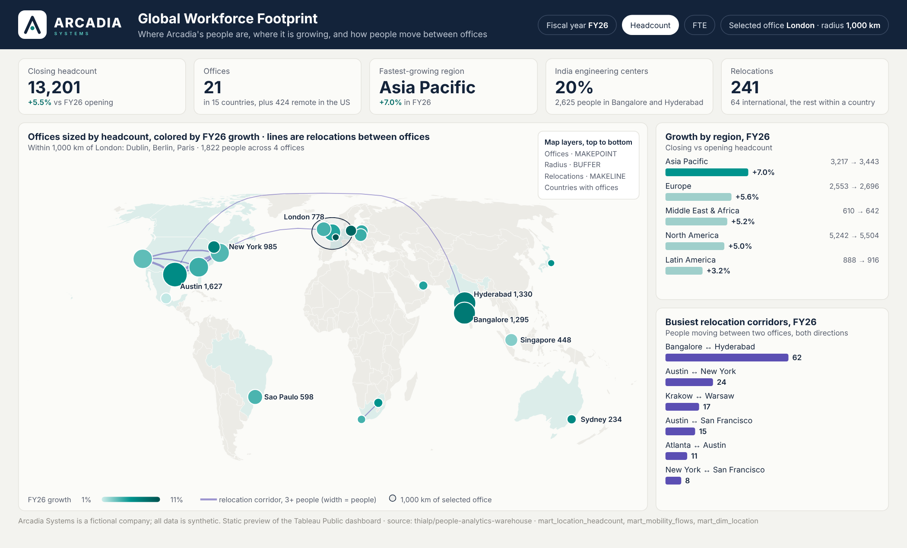

# Building the Global Workforce Footprint Dashboard in Tableau Public

This guide builds the third dashboard: one map that answers **where Arcadia's people are, where it is growing, and how people move between offices**. It is deliberately simple to read (one map, two bar charts, five numbers) and puts the technique into the map itself: four map layers built with Tableau's spatial functions, parameter actions, and the newer viewport and color-range features. Plan on about 90 minutes. Every step lists what you should see.



Before you start, install the Arcadia palettes and get the logo from [`docs/brand/`](../../brand/README.md).

---

## 1. Download the data

From the repository, open each file and click **Download raw file**. Save all four in one folder, for example `Documents/Tableau Public/arcadia-map/`.

| File | Rows | What it is |
|---|---|---|
| [`mart_location_headcount.csv`](../../../data/marts/mart_location_headcount.csv) | 1,581 | One row per office per month: opening, hires, leavers, relocations in and out, closing |
| [`mart_dim_location.csv`](../../../data/marts/mart_dim_location.csv) | 35 | Offices with city, postal code, country, region, site type, GeoNames latitude and longitude and opening date |
| [`mart_mobility_flows.csv`](../../../data/marts/mart_mobility_flows.csv) | 1,117 (1,447 people moved) | People who changed office, as origin and destination with both ends' coordinates |
| [`mart_dim_month.csv`](../../../data/marts/mart_dim_month.csv) | 48 | Month-ends with fiscal year and fiscal month |

Each office walk reconciles every month (opening + hires − leavers + relocations in − relocations out = closing), the offices add up to the company headcount walk, and the flows add up to each office's relocations. Tests 19 to 22 check all three on every build.

Every office has a real postal code and the GeoNames coordinates of that postal code (Dubai has no postal code, since the UAE doesn't use them; its point is the DIFC). Six offices open during the window, so they appear on the map only from their opening month.

## 2. Connect and relate the tables

1. **Connect → To a File → Text file** → `mart_location_headcount.csv`.
2. Drag `mart_dim_location` onto the canvas: related on `location_id`.
3. Drag `mart_dim_month` onto the canvas: related on `month_end_date`.
4. Drag `mart_mobility_flows` onto the canvas and drop it on **`mart_location_headcount`** (not on the others). Set the relationship to two field pairs:
   - `month_end_date` = `month_end_date`
   - `location_id` = `from_location_id`

   Each flow row then belongs to its origin office's month, so the fiscal-year filter reaches the flows too.
5. Set types: every `*_latitude`, `*_longitude`, `latitude`, `longitude` → **Number (decimal)**. `month_end_date` → **Date**. `fiscal_year` and `fiscal_month` → **Number (whole)**. `country_name` → **Geographic role → Country/Region**.

**Check:** a sheet with `Fiscal Year` on Rows and `SUM(Closing Headcount)` filtered to `Fiscal Month` = 12 shows 30,024 for 2026.

## 3. Parameters

| Name | Type | Values | Default |
|---|---|---|---|
| **Selected FY** | Integer | List: 2023, 2024, 2025, 2026 (display as FY23 … FY26) | 2026 |
| **Selected Office** | String | List, **Add values from** `city` | London |
| **Radius km** | Integer | Range 250 to 3,000, step 250 | 1000 |
| **Min People on a Path** | Integer | Range 1 to 20, step 1 | 3 |

## 4. Calculated fields

### Period
```
// In FY
[Fiscal Year] = [Selected FY]
```
```
// Opening HC
SUM(IF [In FY] AND [Fiscal Month] = 1 THEN [Opening Headcount] END)
```
```
// Closing HC
SUM(IF [In FY] AND [Fiscal Month] = 12 THEN [Closing Headcount] END)
```
```
// Growth %
([Closing HC] - [Opening HC]) / [Opening HC]
```
```
// Relocations (each move counted once, on arrival)
SUM(IF [In FY] THEN [Relocations In] END)
```

### Spatial: offices, paths and the radius
```
// Office Point
// One point per office, from the fiscal year-end row only, so a year's 12 rows don't stack.
IF [In FY] AND [Fiscal Month] = 12 THEN MAKEPOINT([Latitude], [Longitude]) END
```
```
// Corridor
// Both directions of a pair share one name, so A to B and B to A draw as one line.
IF [From City] < [To City] THEN [From City] + " ↔ " + [To City]
ELSE [To City] + " ↔ " + [From City] END
```
```
// Corridor People FY
{ FIXED [Corridor], [Fiscal Year] : SUM([Workers]) }
```
```
// Corridor People
// People on a corridor in the selected year; used for line width and the corridor chart.
SUM(IF [Fiscal Year] = [Selected FY] THEN [Workers] END)
```
```
// Relocation Path
// MAKELINE draws a geodesic line between two points. Paths below the threshold return NULL
// and are not drawn, which keeps the map readable without a sheet-level filter.
IF [Fiscal Year] = [Selected FY] AND [Has Coordinates]
   AND [Corridor People FY] >= [Min People on a Path]
THEN MAKELINE(MAKEPOINT([From Latitude], [From Longitude]),
              MAKEPOINT([To Latitude],   [To Longitude]))
END
```
```
// Selected Point
MAKEPOINT({ FIXED : MAX(IF [City] = [Selected Office] THEN [Latitude]  END) },
          { FIXED : MAX(IF [City] = [Selected Office] THEN [Longitude] END) })
```
```
// Radius Ring
BUFFER([Selected Point], [Radius km], "km")
```
```
// Distance to Selected (km)
DISTANCE(MAKEPOINT([Latitude], [Longitude]), [Selected Point], "km")
```
```
// People Within Radius
SUM(IF [In FY] AND [Fiscal Month] = 12 AND [Distance to Selected (km)] <= [Radius km]
    THEN [Closing Headcount] END)
```

`BUFFER` answers a real planning question: if a team in the selected office needs to grow, how many people and offices sit within a short trip? The ring shows the area; `People Within Radius` puts a number on it.

**Check against FY26** (Selected FY 2026, London, 1,000 km, minimum 3):

| Field | Expected |
|---|---|
| Closing HC | 30,024 |
| Growth %, Asia Pacific | +5.2% (9,320 → 9,803) |
| Relocations | 392, of which 135 international |
| Offices within 1,000 km of London | Paris, Amsterdam, Dublin, Zurich, Munich, Berlin, plus London itself |
| People Within Radius | 3,903 |
| Busiest corridor | Bengaluru ↔ Hyderabad, 55 people |

## 5. The map: four layers

1. New sheet **Map**. Double-click `Office Point`. Tableau draws a map with one mark.
2. Drag `Location Id` and `City` to **Detail** so each office is its own mark. Put `Closing HC` on **Size** and `Growth %` on **Color** (palette *Arcadia Teal Sequential*). Under **Color → Effects**, set the border to white.
3. **Add the relocation layer.** Drag `Relocation Path` onto the map and drop it on **Add a Marks Layer**. In that layer: `Corridor` on **Detail**, `Corridor People` on **Size**, color violet `#5B4FB3` at 60% opacity, mark type **Line**.
4. **Add the radius layer.** Drag `Radius Ring` onto **Add a Marks Layer**. Color navy `#13233A` at 8% opacity with a navy border.
5. **Add the country layer.** Drag `Country Name` onto **Add a Marks Layer**. Mark type **Map** (filled), color `#DCEDEA`, no border. These are the 22 countries with an office.
6. **Order the layers** in the Marks card by dragging: Office Point on top, then Radius Ring, Relocation Path, Country Name at the bottom.
7. On the Country, Radius and Path layers, click the layer's drop-down → **Disable Selection**, so clicks always land on an office.
8. **Map → Background Maps → Light**. **Map → Map Layers**: washout 40%, untick everything except Base and Coastline.
9. Label only what matters: put `City` and `Closing HC` on **Label** in the office layer, then **Label → Marks to Label → Selected** (or **Min/Max**) instead of all.

**Check:** with defaults you should see 11 violet corridors, the Austin hub lines across the US, and a ring around London touching Dublin, Paris and Berlin.

## 6. The supporting sheets

1. **KPI tiles** (five Text sheets): Closing HC with Growth % beneath; Offices (`COUNTD(Location Id)`) with offices opened in the period beneath; Fastest-growing region (sort `Region` by Growth % and keep the top 1); India share (`Closing HC` for country India ÷ total); Relocations, with international ones beneath (filter `Flow Scope`).
2. **Growth by region:** `Region` on Rows sorted by Growth %, `Growth %` on Columns as bars. Color the top bar teal and the rest `#9FCFCB` with a calculated field `RANK([Growth %]) = 1`. Label the bar ends; show `Opening HC → Closing HC` in the label or tooltip.
3. **Busiest corridors:** `Corridor` on Rows, `Corridor People` on Columns, sorted descending, top 6 (**Filter → Top → By field**). Violet bars.
4. **Offices in view** (optional, see section 8): a text table of City, Closing HC and Growth %.

## 7. Dashboard and actions

Size **1400 × 850**. Layout, top to bottom:

1. **Header band**: a horizontal container with background navy `#13233A`. Inside: the reverse logo (Image object, `arcadia_logo_horizontal_reverse.png`), the title "Global Workforce Footprint" in white with the one-line subtitle, and on the right the four parameter controls.
2. **KPI band**: the five tiles in a horizontal container, each on an off-white card.
3. **Main row**: the map (left, about two-thirds) and a vertical container with the two bar charts (right).
4. **Footer**: "Arcadia Systems is a fictional company; all data is synthetic", plus the GitHub link.

Actions (**Dashboard → Actions**):

- **Parameter action, Select office:** source sheet Map, run on **Select**, target parameter **Selected Office**, source field **City**. Clicking an office moves the ring there and updates `People Within Radius`. Set "When clearing the selection" to **Keep current value**.
- **Filter action:** clicking a region bar filters the corridor chart to corridors starting in that region (`From Region`).
- **Highlight action:** hovering a corridor bar highlights its line on the map (target field `Corridor`).
- **Dynamic title:** make the map title a calculated sentence, for example *"Within 1,000 km of London: 4 offices, 1,822 people"*, built from the parameters and `People Within Radius`, so the chart states its own finding.

Tooltips: on the office layer, show City, Site Type, Closing HC, Growth %, hires, leavers and relocations in and out, and insert a small monthly closing trend with **Insert → Sheets** (viz in tooltip).

## 8. Newer features worth showing (Tableau 2025.1 and later)

These features are recent, so check them in your Tableau Public version; the dashboard works without them.

- **Map viewport parameter (2025.2+):** create a parameter of type **Spatial**, allowable values **All**, and under **Dynamic value → Map Viewport** pick the Map sheet. Then filter the *Offices in view* table with `INTERSECTS([Office Point], [Map View])` = True. Zoom into Europe and the table lists only European offices. Tableau's help documents this for Desktop and Cloud; if the option isn't there in your Tableau Public, skip it.
- **Dynamic color ranges (2025.2+):** in **Edit Colors → Advanced**, set the start and end of the growth color range to parameters (for example 0% and 12%), so colors mean the same thing in every fiscal year instead of rescaling to each year's spread.
- **Custom color palettes (2025.3+) and custom themes (2025.1+):** the Arcadia palettes in [`docs/brand/`](../../brand/README.md) are ready to load, and exporting the styled workbook as a theme gives the other two dashboards the same look in one step.

## 9. Methodology text (paste into the Methodology page or an info button)

> **What this shows.** Headcount by office for Arcadia Systems, a fictional company with synthetic data. Offices are sized by fiscal year-end headcount and colored by growth over the year. Lines are relocations: people who were at one office at a month-end and at another at the next.
>
> **Definitions.** Headcount counts every worker active on the month-end. A relocation is any change of office, including between two offices in the same country. Lines combine both directions of a pair and show only corridors with at least the selected number of people. Distances and the radius are great-circle distances from postal-code coordinates, not commute times.
>
> **Controls.** Each office reconciles every month (opening + hires − leavers + relocations in − relocations out = closing). Offices add up to the company headcount walk. Flows add up to each office's relocations. Relocations net to zero company-wide.
>
> **Limits.** Coordinates are postal-code centroids, not building locations; street addresses are fictional.

## 10. Publish

1. **File → Save to Tableau Public As…** → **Arcadia Global Workforce Footprint**.
2. **Edit Details**: a one-paragraph description and the GitHub link `https://github.com/thialp/people-analytics-warehouse`.
3. Allow **Download** of the workbook, so reviewers can open the spatial calculations.
4. Add the workbook URL to the README.

**Before you publish, check:** the FY26 values in section 4 match, clicking an office moves the ring, and no sheet still carries a test filter.
