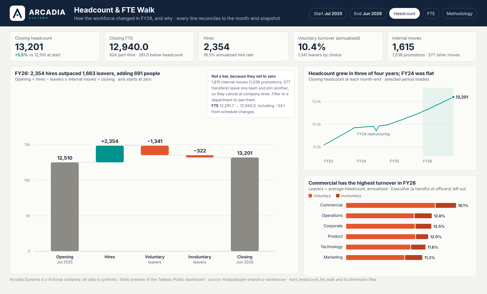

# Building the Headcount & FTE Walk Dashboard in Tableau Public

This guide builds the second dashboard, from [`mart_headcount_fte_walk`](../data/marts/mart_headcount_fte_walk.csv) and its five small dimension files. Plan on about two hours. Every step lists what you should see, so you can check as you go.

The finished workbook has four dashboards, one per audience:

| Dashboard | Reader | Answers |
|---|---|---|
| 1. Executive Summary | CHRO, CFO | How much did the workforce grow, and from what? |
| 2. Movement Drivers | HR business partners | Where are hires, leavers and internal moves concentrated? |
| 3. Diagnostics | Analysts | Which slices moved, and does every line reconcile? |
| 4. Methodology | Anyone | How the numbers are defined, and their limits |



The workbook uses the Arcadia look shared by all three dashboards: navy header band with the logo, a row of KPI cards, charts on off-white cards, teal for growth, coral for leavers. Install the palettes and get the logo from [`docs/brand/`](brand/README.md) before you start.

---

## 1. Download the data

From the repository, open each file below and click **Download raw file** (the arrow at the top right). Save all six in one folder, for example `Documents/Tableau Public/arcadia-headcount/`.

| File | Rows | What it is |
|---|---|---|
| [`mart_headcount_fte_walk.csv`](../data/marts/mart_headcount_fte_walk.csv) | 292,696 | The walk (fact table), codes only, about 15 MB |
| [`mart_dim_month.csv`](../data/marts/mart_dim_month.csv) | 48 | Month-ends with fiscal year, quarter, period |
| [`mart_dim_department.csv`](../data/marts/mart_dim_department.csv) | 32 | Department, sub-function, function, cost center |
| [`mart_dim_country.csv`](../data/marts/mart_dim_country.csv) | 15 | Country and region |
| [`mart_dim_job_family.csv`](../data/marts/mart_dim_job_family.csv) | 14 | Job family names |
| [`mart_dim_grade.csv`](../data/marts/mart_dim_grade.csv) | 9 | Grade level and career track |

Why six files and not one: names repeated on 292,696 rows would make a single file almost four times larger (57 MB). A star schema keeps the export small, and Tableau's relationships put it back together.

## 2. Connect and relate the tables

1. Open **Tableau Public**. **Connect → To a File → Text file** → `mart_headcount_fte_walk.csv`.
2. From the left panel, drag each `mart_dim_*` file onto the canvas next to the walk table. Tableau draws a "noodle" (a relationship) to the walk table each time.
3. Click each noodle and check the matching field. Tableau usually finds it on its own, because the column names match:

| Dimension file | Related on |
|---|---|
| `mart_dim_month` | `month_end_date` = `month_end_date` |
| `mart_dim_department` | `department_id` = `department_id` |
| `mart_dim_country` | `country_code` = `country_code` |
| `mart_dim_job_family` | `job_family_code` = `job_family_code` |
| `mart_dim_grade` | `grade` = `grade` |

4. In the data grid, set types by clicking the icon above each column:
   - `month_end_date` and `prior_month_end_date`: **Date**
   - `grade`: **String** in both the walk and the grade file (it's a label, not a number to sum)
   - `fiscal_year`: **String**
   - `headcount`: **Number (whole)**, `fte`: **Number (decimal)**

**Check:** on a new sheet, drag `Movement Category` to Rows and `SUM(Headcount)` to Text. Opening and Closing are large positive numbers (each month's levels added up), the four movement categories are signed, and FTE Changes shows 0 headcount.

Relationships, not joins, are the right choice here: each dimension is one row per key, and Tableau only queries the tables a sheet actually uses.

## 3. Parameters

Create four parameters (right-click the Data pane → **Create Parameter**):

| Name | Type | Values | Default |
|---|---|---|---|
| **Start Month** | Date | List, **Add values from** `month_end_date` | 2025-07-31 |
| **End Month** | Date | List, **Add values from** `month_end_date` | 2026-06-30 |
| **Measure** | String | List: `Headcount`, `FTE` | Headcount |
| **Show Methodology** | Boolean | True / False | False |

Show **Start Month** and **End Month** as controls on every dashboard (right-click → **Show Parameter**). **Measure** is switched with the pill buttons described in Section 6.

## 4. Calculated fields

Create these in order; later ones use earlier ones. Field names in brackets must match yours exactly.

### Core
```
// Selected Value
IF [Measure] = "Headcount" THEN [Headcount] ELSE [Fte] END
```
```
// In Range
[Month End Date] >= [Start Month] AND [Month End Date] <= [End Month]
```
```
// Walk Value
// Opening comes from the first month, Closing from the last, and every
// movement is summed across the months in between. This works because the
// SQL guarantees each month's Closing equals the next month's Opening (test 14).
IF [In Range] THEN
    CASE [Movement Category]
        WHEN "Opening" THEN IIF([Month End Date] = [Start Month], [Selected Value], 0)
        WHEN "Closing" THEN IIF([Month End Date] = [End Month],   [Selected Value], 0)
        ELSE [Selected Value]
    END
END
```

### KPIs
```
// Opening
SUM(IF [In Range] AND [Movement Category] = "Opening" AND [Month End Date] = [Start Month]
    THEN [Selected Value] END)
```
```
// Closing
SUM(IF [In Range] AND [Movement Category] = "Closing" AND [Month End Date] = [End Month]
    THEN [Selected Value] END)
```
```
// Net Change %
([Closing] - [Opening]) / [Opening]
```
```
// Months in Range
COUNTD(IF [In Range] THEN [Month End Date] END)
```
```
// Average Headcount
// Each month's average is (opening + closing) / 2; this averages those across the range.
SUM(IF [In Range] AND ([Movement Category] = "Opening" OR [Movement Category] = "Closing")
    THEN [Headcount] END) / 2 / [Months in Range]
```
```
// Hires
SUM(IF [In Range] AND [Movement Category] = "Hires" THEN [Headcount] END)
```
```
// Voluntary Leavers
-SUM(IF [In Range] AND [Movement Category] = "Voluntary Terminations" THEN [Headcount] END)
```
```
// Involuntary Leavers
-SUM(IF [In Range] AND [Movement Category] = "Involuntary Terminations" THEN [Headcount] END)
```
```
// Voluntary Turnover (annualized)
ZN([Voluntary Leavers]) / [Average Headcount] * 12 / [Months in Range]
```
```
// Involuntary Turnover (annualized)
ZN([Involuntary Leavers]) / [Average Headcount] * 12 / [Months in Range]
```
```
// Hire Rate (annualized)
ZN([Hires]) / [Average Headcount] * 12 / [Months in Range]
```
```
// Internal Moves
SUM(IF [In Range] AND [Movement Category] = "Internal Moves In" THEN [Headcount] END)
```

Format the three rate fields as **Percentage, 1 decimal**.

### Control (shown on the Diagnostics dashboard)
```
// Walk Gap
// Opening + every movement - Closing. Must be 0 for any slice and any range.
SUM([Walk Value]) - 2 * [Closing]
```
`SUM([Walk Value])` already includes Closing once, so subtracting twice leaves Opening + movements − Closing.

### Small-group rule
```
// Rate Shown
// Rates on fewer than 20 people swing wildly; hide them rather than mislead.
IF [Average Headcount] < 20 THEN NULL ELSE [Voluntary Turnover (annualized)] END
```

### Set for comparisons
Right-click `Department Name` → **Create → Set** → name it **Selected Departments**, pick any one department. Then:
```
// Selected vs Rest
IF [Selected Departments] THEN "Selected" ELSE "Rest of company" END
```

**Check against these FY26 values** (Start Month 2025-07-31, End Month 2026-06-30, Measure Headcount):

| Field | Expected |
|---|---|
| Opening | 12,510 |
| Hires | 2,354 |
| Voluntary Leavers | 1,341 |
| Involuntary Leavers | 322 |
| Internal Moves | 1,615 (1,038 promotions, 577 transfers) |
| Closing | 13,201 |
| Net Change % | 5.5% |
| Voluntary Turnover (annualized) | 10.4% |
| Walk Gap | 0 |

With Measure = FTE: Opening 12,281.7, Closing 12,940.0 (shown as 12,940 on the card), FTE Changes −34.1.

If a number is off, the usual cause is a type (Step 2.4) or a filter left on a sheet.

## 5. Sheets

### Executive Summary
1. **KPI band.** Five cards under the header, drawn as map layers so the numbers, the notes and the card layout all come from calculated fields. Follow [the KPI cards guide](tableau_kpi_cards_guide.md); it replaces five separate text sheets with one sheet.
2. **Headcount waterfall.** This is the main exhibit. It is a Gantt chart, so every bar is a start position plus a length, and the running total has to be an aggregate calculation. (Putting a *dimension* on Color splits the marks into groups and restarts the running total inside each group. That is the most common way this chart breaks.)
   - Create three calculated fields:
     ```
     // Waterfall Position
     // Movement bars end at the running total; Opening and Closing sit on the total itself.
     // Compute Using: Movement Category (sorted by Movement Order).
     IF ATTR([Movement Category]) = "Closing"
         THEN SUM([Walk Value])
         ELSE RUNNING_SUM(SUM([Walk Value]))
     END
     ```
     ```
     // Waterfall Size
     // Negative on purpose: a Gantt bar grows to the right of its start, so a negative size
     // draws the bar backwards from the running total to where it began.
     -SUM([Walk Value])
     ```
     ```
     // Bar Type  (an aggregate, so it can go on Color without splitting the table calculation)
     IF ATTR([Movement Category]) = "Opening" OR ATTR([Movement Category]) = "Closing" THEN "Level"
     ELSEIF SUM([Walk Value]) >= 0 THEN "Increase"
     ELSE "Decrease"
     END
     ```
   - Columns: `Movement Category`, sorted by `Movement Order` (right-click → Sort → Field → Movement Order, Minimum, Ascending). Keep **Closing** in the view: it is its own bar, so no filter and no grand total are needed.
   - Rows: `Waterfall Position` → right-click → **Compute Using → Movement Category**.
   - Mark type **Gantt Bar**. Drag `Waterfall Size` to **Size**, and `Bar Type` to **Color**.
   - **Edit Colors:** Level warm gray `#8C8A84`, Increase teal `#00938D`, Decrease coral `#E4572E`.
   - Right-click the axis → **Edit Axis** → tick **Include zero**. Bars start at zero so the size of each movement isn't exaggerated (Viz of the Day reviewers check this).
   - **Dynamic title and caption.** The title states the finding and the caption explains what is *not* a bar (internal moves). Both are text built from calculated fields. The sheet's marks are split by `Movement Category`, so every number they use must be a **FIXED** calculation (a plain `SUM` would only see one category's rows). Create these fields:

   ```
   // WF Open
   ZN({ FIXED : SUM(IF [In Range] AND [Movement Category] = "Opening" AND [Month End Date] = [Start Month] THEN [Headcount] END) })
   ```
   ```
   // WF Close
   ZN({ FIXED : SUM(IF [In Range] AND [Movement Category] = "Closing" AND [Month End Date] = [End Month] THEN [Headcount] END) })
   ```
   ```
   // WF Hires
   ZN({ FIXED : SUM(IF [In Range] AND [Movement Category] = "Hires" THEN [Headcount] END) })
   ```
   ```
   // WF Leavers
   ZN({ FIXED : -SUM(IF [In Range] AND ([Movement Category] = "Voluntary Terminations" OR [Movement Category] = "Involuntary Terminations") THEN [Headcount] END) })
   ```
   ```
   // WF Moves
   ZN({ FIXED : SUM(IF [In Range] AND [Movement Category] = "Internal Moves In" THEN [Headcount] END) })
   ```
   ```
   // WF Promos
   ZN({ FIXED : SUM(IF [In Range] AND [Movement Category] = "Internal Moves In" AND [Movement Reason] = "Promotion" THEN [Headcount] END) })
   ```
   ```
   // WF FTE Open
   ZN({ FIXED : SUM(IF [In Range] AND [Movement Category] = "Opening" AND [Month End Date] = [Start Month] THEN [Fte] END) })
   ```
   ```
   // WF FTE Close
   ZN({ FIXED : SUM(IF [In Range] AND [Movement Category] = "Closing" AND [Month End Date] = [End Month] THEN [Fte] END) })
   ```
   ```
   // WF FTE Chg
   ZN({ FIXED : SUM(IF [In Range] AND [Movement Category] = "FTE Changes" THEN [Fte] END) })
   ```

   Text helpers (the comma pattern from the KPI cards guide, Section 4.2; shown once, then the field list):
   ```
   // WF Hires Str
   IF [WF Hires] >= 1000
   THEN STR(DIV(INT([WF Hires]), 1000)) + "," + RIGHT("00" + STR(INT([WF Hires]) % 1000), 3)
   ELSE STR(INT([WF Hires])) END
   ```
   Create the same pattern for `WF Leavers Str` (on `[WF Leavers]`), `WF Net Str` (on `ABS([WF Close] - [WF Open])`), `WF Moves Str` (`[WF Moves]`), `WF Promos Str` (`[WF Promos]`), `WF Other Str` (`[WF Moves] - [WF Promos]`), `WF FTE Open Str` (`ROUND([WF FTE Open], 0)`) and `WF FTE Close Str` (`ROUND([WF FTE Close], 0)`). Wrap the expression in `INT(...)` as above. Then:

   ```
   // WF FTE Chg Str   (signed, whole number)
   IF ROUND([WF FTE Chg], 0) < 0 THEN "−" ELSE "+" END +
   STR(INT(ABS(ROUND([WF FTE Chg], 0))))
   ```
   ```
   // WF Period   (a 12-month range reads as the fiscal year; Arcadia's year starts July 1)
   IF DATEDIFF('month', [Start Month], [End Month]) = 11
   THEN "FY" + RIGHT(STR(YEAR([End Month]) + IF MONTH([End Month]) >= 7 THEN 1 ELSE 0 END), 2)
   ELSE LEFT(DATENAME('month', [Start Month]), 3) + " " + STR(YEAR([Start Month])) + " – " +
        LEFT(DATENAME('month', [End Month]), 3) + " " + STR(YEAR([End Month]))
   END
   ```
   ```
   // WF Title
   IF NOT [K Valid] THEN "Choose a start month on or before the end month"
   ELSE [WF Period] + ": " + [WF Hires Str] + " hires " +
        IF [WF Hires] >= [WF Leavers] THEN "outpaced " ELSE "fell short of " END +
        [WF Leavers Str] + " leavers, " +
        IF [WF Close] >= [WF Open] THEN "adding " ELSE "removing " END +
        [WF Net Str] + " people"
   END
   ```
   ```
   // WF Caption
   IF NOT [K Valid] THEN "" ELSE
   [WF Moves Str] + " internal moves (" + [WF Promos Str] + " promotions, " + [WF Other Str] +
   " other) move people between teams, so they net to zero at company level. FTE " +
   [WF FTE Open Str] + " → " + [WF FTE Close Str] + ", including " + [WF FTE Chg Str] + " from schedule changes."
   END
   ```

   - *Title:* on the waterfall sheet, drag `WF Title` to **Detail** (it has one value, so it does not split the marks), then **Worksheet → Show Title**, double-click the title, **Insert → `WF Title`**, and set Tableau Bold 12 pt navy. Add a second line of static text, Tableau Book 9 pt slate: `Opening + hires − leavers ± internal moves = closing · axis starts at zero`.
   - *Caption:* create a new worksheet **Waterfall Caption**: drag `WF Caption` to **Label** on a Text mark (Tableau Book 8 pt slate, alignment left, wrap on), hide headers and title, Entire View. On the dashboard float it at the bottom of the waterfall card (see the layout table in the KPI guide) and set the waterfall sheet's bottom **inner padding** to 64 so the chart stops above it.
   - For FY26 these read: *"FY26: 2,354 hires outpaced 1,663 leavers, adding 691 people"* and *"1,615 internal moves (1,038 promotions, 577 other) move people between teams, so they net to zero at company level. FTE 12,281.7 → 12,940.0, including −34.1 from schedule changes."*
   - The title and caption use headcount even when Measure is FTE (the caption already shows the FTE change). They ignore filters on the waterfall sheet because of FIXED; a filter action on the dashboard will not change them.
   - Hide the *Bar Type* legend (select it on the dashboard and delete it; the colors are explained by the labels), and add a filter so the **FTE Changes** bar only appears when Measure is FTE: create `Show Category` = `[Measure] = "FTE" OR [Movement Category] <> "FTE Changes"`, drag it to Filters and keep True.
   - **Check:** the Closing bar's top equals the `Closing` KPI, and the last movement bar ends exactly where the Closing bar starts.
   - At company level Internal Moves In and Out cancel (+1,615 and −1,615). Hide them with a filter on this sheet if you prefer a cleaner company view; they matter on department views.
3. **Headcount trend.** Columns: `Month End Date` (continuous month). Rows: `SUM(IF [Movement Category] = "Closing" THEN [Selected Value] END)`. Don't filter this to the range: show all history, and add a **reference band** from `Start Month` to `End Month` so the selected period stands out. Line in teal `#00938D`, band in teal at 10% opacity, and label only the last point.

### Movement Drivers
4. **Turnover by function.** Rows: `Function Name`. Columns: `Voluntary Turnover (annualized)` and `Involuntary Turnover (annualized)` as a stacked bar (Measure Names on Color: coral `#E4572E` for voluntary, dark coral `#B8401F` for involuntary). Sort descending. Label the bar ends with the total rate, and title the sheet with the top function, for example *"Commercial has the highest turnover in FY26"*.
5. **Net change heatmap.** Rows: `Function Name`, Columns: `Fiscal Period`, Color: `SUM(IF [Movement Category] <> "Opening" AND [Movement Category] <> "Closing" THEN [Selected Value] END)`, palette *Arcadia Coral-Teal Diverging* centered at 0 (coral for shrinking, teal for growing). This shows where growth and shrinkage happened month by month.
6. **Internal moves by reason.** Rows: `Movement Reason`, filtered to `Internal Moves In`, bars by `Grade Level`. Promotions show as a move out of one grade and into the next, so a grade-level view of the walk explains career progression without any extra logic.

### Diagnostics
7. **Slice table.** Rows: `Function Name` → `Department Name` → `Country Name` → `Grade` (build a hierarchy: drag Department onto Function, and so on, so readers can drill with the + icons). Columns: `Measure Names` with Opening, Hires, Voluntary Leavers, Involuntary Leavers, Internal Moves, Closing, Walk Gap.
8. **Control tile.** A single Text sheet with `Walk Gap` and the caption "Opening + movements − Closing for every slice in view. 0 means the walk reconciles." This makes data quality visible instead of assumed.

## 6. Dashboards and actions

Use a fixed size of **1400 × 850** for each dashboard, the same as the workforce map, with the page background stone `#F3F3EF`.

Every dashboard starts with the same **header band**: a horizontal container with background navy `#13233A` holding the reverse logo (Image object, `docs/brand/arcadia_logo_horizontal_reverse.png`), the dashboard title in white with a one-line subtitle, and the parameter controls on the right. Put each chart on its own off-white `#FBFBF8` card (a container with a 1px `#E4E3DD` border) with 12px between cards.

1. **Executive Summary**: header band, the KPI card map sheet across the top, waterfall (left, about 60%), and on the right the trend above turnover by function.
2. **Movement Drivers**: turnover by function (left), heatmap (right), internal moves (bottom).
3. **Diagnostics**: control tile top right, slice table filling the rest.
4. **Methodology**: a text object with the definitions from Section 7.

Actions (**Dashboard → Actions**):

- **Filter action:** on Movement Drivers, clicking a function in the turnover chart filters the heatmap and internal moves to that function. Clearing the selection shows all values.
- **Set action:** on Movement Drivers, selecting departments in the heatmap updates **Selected Departments**; add `Selected vs Rest` to the color of the turnover chart so a selection is compared against the rest of the company.
- **Parameter action (the Headcount / FTE pills):** no image buttons are needed. Build one small sheet, **Measure Toggle**:
  ```
  // Measure Option  (two rows: one for each choice)
  IF [Movement Category] = "Opening" THEN "Headcount"
  ELSEIF [Movement Category] = "Closing" THEN "FTE"
  END
  ```
  ```
  // Option State
  IF [Measure Option] = [Measure] THEN "On" ELSE "Off" END
  ```
  Filter `Measure Option` to exclude Null. Put `Measure Option` on Rows (or Columns for a side-by-side pair), `Option State` on Color and `Measure Option` on Label. Set the mark type to **Square**, size it to fill the cell, and color On navy `#13233A`, Off off-white `#FBFBF8`. Set the label color to Automatic so white text appears on navy. Hide the headers and borders, and turn off tooltips. Then add a **Change Parameter** action: Source = this sheet, Run on **Select**, Target parameter = **Measure**, Field = `Measure Option`, and **Clearing the selection will: Keep current value**. Because the color is driven by the parameter, the selected pill always looks selected, with one sheet and no images.
  The same pattern works for the Methodology pill: a one-row sheet whose color depends on `Show Methodology`.
  Start Month and End Month stay as native parameter controls (compact dropdowns). Tableau cannot restyle those into pills, so keep them neutral and let the pills carry the emphasis.
- **Dynamic zone visibility:** on the Executive Summary, add a container holding a short methodology note, and under **Layout → Control visibility using value** pick `Show Methodology`. A button sheet with a parameter action toggles it.
- **Navigation:** add **Navigation** buttons along the top of each dashboard so all four read as one product.

Tooltips: on the waterfall, use viz-in-tooltip to show the 12-month trend of the hovered category (**Insert → Sheets** in the tooltip editor).

## 7. Methodology text (paste into dashboard 4)

> **What this shows.** A monthly headcount and FTE walk for Arcadia Systems, a fictional company with synthetic data. For any slice (department, country, job family, grade) and any range of months: Opening + Hires − Terminations ± Internal Moves ± FTE Changes = Closing.
>
> **Definitions.** Headcount counts every worker active on the month-end, executive officers included; a part-time worker counts as one. FTE weights each worker by their scheduled fraction. A termination date is the last day worked. Internal moves are changes of department, country, job family or grade between two month-ends; when several change at once, one reason is recorded (department, then country, then grade, then job family). Movers are counted at their prior FTE; a same-month FTE change shows separately. Turnover rates are annualized: leavers ÷ average headcount × 12 ÷ months in range.
>
> **Controls.** Eighteen automated tests run on every build. Among them: every slice reconciles each month; each month's closing equals the next month's opening; opening and closing match an independent count of the month-end snapshot; internal moves net to zero company-wide; hires and leavers match the worker master's dates.
>
> **Limits.** Someone hired and terminated within one month never appears at a month-end, so a month-end walk can't show them (none occur in this dataset; the model counts them separately). Location changes within the same country don't change a slice, so they aren't moves at this grain.

## 8. Publish

1. **File → Save to Tableau Public As…** and name it **Arcadia Headcount & FTE Walk**.
2. When it opens in the browser, click **Edit Details** and paste a one-paragraph description plus the GitHub link: `https://github.com/thialp/people-analytics-warehouse`.
3. Under the workbook's settings, allow **Download** of the workbook so reviewers can open your calculated fields.
4. Copy the workbook URL and add it to the README (the "Dashboard" row and Section 9), or send it to me to update.

**Before you publish, check:** Walk Gap shows 0, the FY26 numbers in Section 4 match, and no sheet still carries a test filter.
